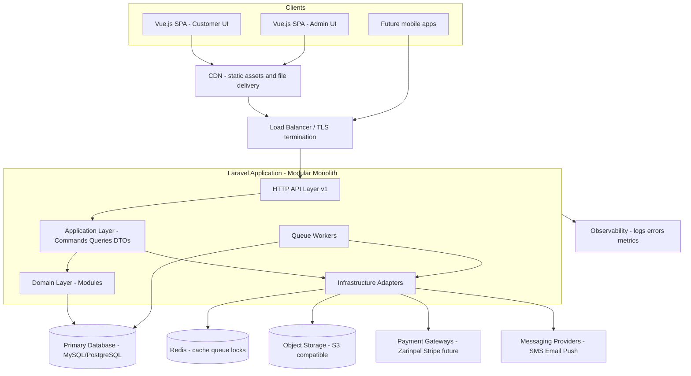
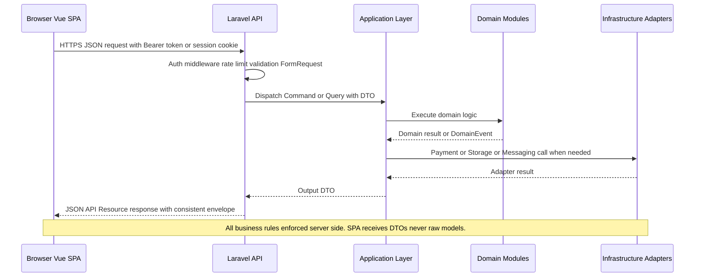
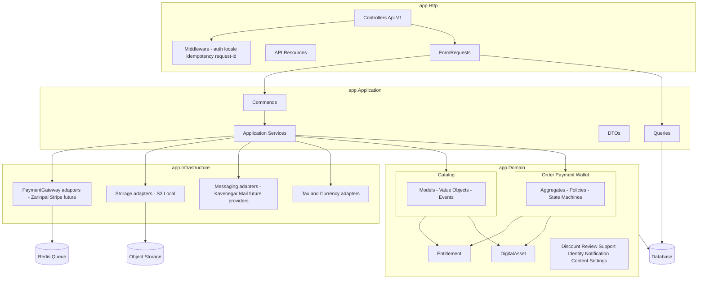
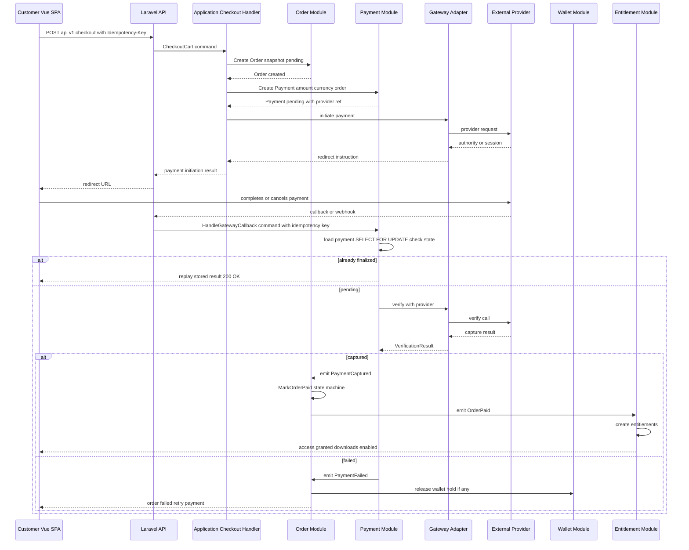
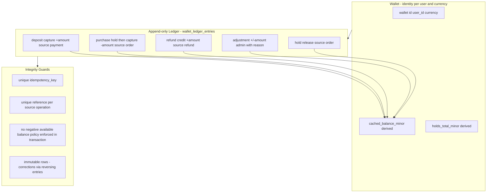
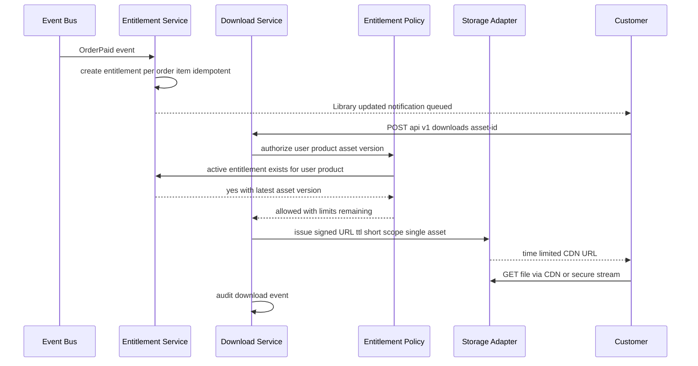
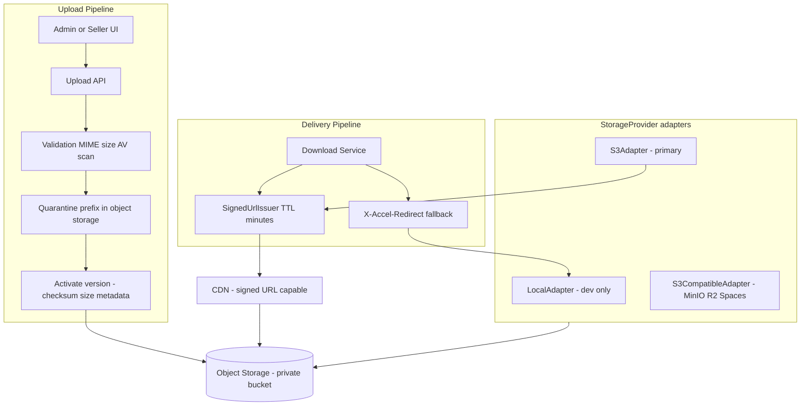
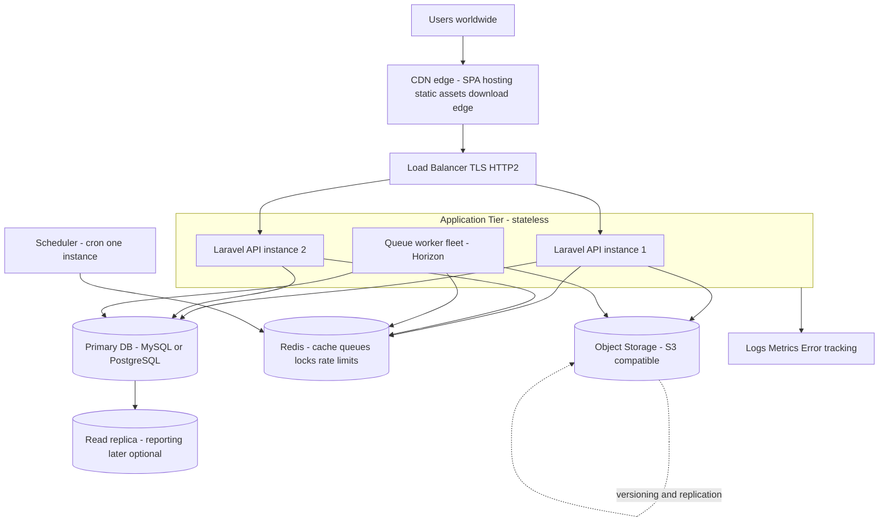
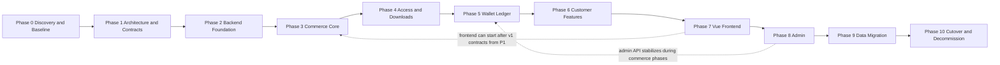

# REWRITE_PLAN.md — File-Store Technical Rewrite & Re-Architecture Plan

> **Status:** `Proposed` — This document is a technical plan and recommendation. It does **not** mean a rewrite has been approved or started. It exists so the team can make an informed decision and, if approved, execute in controlled phases.

| Field | Value |
|---|---|
| Document type | Technical design / re-architecture plan |
| Repository audited | `Arash-abraham/File-Store` (working branch, audited 2026-09-30) |
| Current stack | Laravel 12 + Blade + Alpine.js + Tailwind (server-rendered monolith) |
| Proposed backend | Laravel 12 (PHP 8.2+) — **Modular Monolith, API-first** |
| Proposed frontend | **Vue.js** SPA (separate application, TypeScript) |
| Long-term product direction | International Digital Product Marketplace / Digital Asset Commerce Platform |
| Document language | English |

**Evidence labels used throughout this document:**

- `Confirmed from Existing Code` — directly verified in the current repository (file/class references given).
- `Needs Verification` — strong suspicion from code reading, but requires a runtime/database check.
- `Proposed` — a recommendation; it does not exist yet.
- `Open Question` — requires a product/business decision before implementation.

---

## Table of Contents

1. [Executive Summary](#1-executive-summary)
2. [Current Project Overview](#2-current-project-overview)
3. [Current Architecture Assessment](#3-current-architecture-assessment)
4. [Why a Rewrite/Re-architecture Is Being Considered](#4-why-a-rewritere-architecture-is-being-considered)
5. [Rewrite Principles](#5-rewrite-principles)
6. [Product Vision](#6-product-vision)
7. [Internationalization Strategy](#7-internationalization-strategy)
8. [Target Architecture](#8-target-architecture)
9. [Backend Architecture](#9-backend-architecture)
10. [Vue Frontend Architecture](#10-vue-frontend-architecture)
11. [API Architecture](#11-api-architecture)
12. [Domain Boundaries](#12-domain-boundaries)
13. [Database Redesign](#13-database-redesign)
14. [Payment Architecture](#14-payment-architecture)
15. [Wallet Architecture](#15-wallet-architecture)
16. [Order Architecture](#16-order-architecture)
17. [Entitlement Architecture](#17-entitlement-architecture)
18. [Digital Asset Architecture](#18-digital-asset-architecture)
19. [Storage Strategy](#19-storage-strategy)
20. [Authentication & Authorization](#20-authentication--authorization)
21. [Security Strategy](#21-security-strategy)
22. [Testing Strategy](#22-testing-strategy)
23. [Events & Queues](#23-events--queues)
24. [Observability](#24-observability)
25. [Admin Architecture](#25-admin-architecture)
26. [Deployment Architecture](#26-deployment-architecture)
27. [Migration Strategy](#27-migration-strategy)
28. [Data Migration](#28-data-migration)
29. [Backward Compatibility](#29-backward-compatibility)
30. [Development Phases](#30-development-phases)
31. [Risks](#31-risks)
32. [Open Questions](#32-open-questions)
33. [Definition of Done](#33-definition-of-done)
34. [What the Rewrite Must NOT Do](#what-the-rewrite-must-not-do)
35. [Final Recommended Direction](#34-final-recommended-direction)
36. [Appendix — Component Mapping Reference](#35-appendix--component-mapping-reference)

---

## 1. Executive Summary

File-Store is a working Laravel 12 application that already implements a meaningful amount of business functionality: a product catalog, categories/tags, a session- and user-based cart, coupons, an order/payment flow integrated with an Iranian gateway (Zarinpal), a customer wallet with top-ups, downloadable product files, reviews with helpful/report actions, a support-ticket feature, email/SMS OTP login, and a Blade-based admin panel.

A major rewrite/re-architecture is being considered, but **the project should not be blindly rewritten from scratch**. The preferred strategy is:

> **Rebuild the architecture while preserving validated business requirements and useful domain knowledge from the existing system.**

The main findings of the audit (Section 3) are:

- **Functionality exists and mostly works, but the architecture is server-rendered and tightly coupled**: business rules live in controllers, route closures, Blade views, and Eloquent accessors. There is no API layer at all (`routes/api.php` is empty — `Confirmed from Existing Code`).
- **The money-handling code has structural weaknesses**: payment state is mixed into the `orders` table, payment verification is not idempotent/atomic, the wallet cannot be reconciled robustly, and at least one "payment successful" e-mail is sent *before* any money moves (`PaymentService::createPaymentRequest()` — `Confirmed from Existing Code`).
- **The codebase has Iran-specific assumptions baked into the core**: hardcoded Toman→Rial conversion (`×10`) in two separate services, hardcoded `IRR`, hardcoded Iranian phone-number regex (`/^09[0-9]{9}$/`), Persian UI strings inside models/services/notifications, Jalali calendar packages in the payment e-mail path. These are not defects for the current market, but they block the international product direction.
- **The schema has accumulated errors**: duplicate `web_settings` creation migrations, an `orders.final_amount` column that is written in code but never created by any migration, an `order_items.product_title` NOT NULL column that is never populated, and seeders that insert columns which do not exist (`type`, `rating`, `views`) — all `Confirmed from Existing Code`.
- **There is no entitlement concept**: access to purchased files is re-derived on every request by querying `payments → order → items`. This duplicated logic lives in both the dashboard route closure and the download controller (`Confirmed from Existing Code`).

Therefore the recommended direction is an **architectural modernization and product evolution**:

- Keep **Laravel** as the backend (there is no technical reason to change framework).
- Restructure the backend as a **Modular Monolith** organized by business domain, exposed through a versioned, documented **REST/JSON API** (`/api/v1/...`).
- Rebuild the UI as a separate **Vue.js + TypeScript** application — not Blade.
- Introduce first-class architectural concepts that the current system lacks: **Payment gateway abstraction, ledger-based Wallet, Entitlement (separate from Order), Digital Asset with storage abstraction, and Internationalization as a core requirement**.
- Migrate data and users in controlled phases, preserving all financial history.

This document is the official technical plan for that effort.

---

## 2. Current Project Overview

> Everything in this section is `Confirmed from Existing Code` unless explicitly marked otherwise.

### 2.1 Technology inventory

| Layer | Technology | Evidence |
|---|---|---|
| Framework | Laravel 12.x, PHP `^8.2` | `composer.json` |
| Auth scaffolding | Laravel Breeze (dev dependency), session auth, e-mail verification (`MustVerifyEmail`) | `composer.json`, `app/Models/User.php`, `routes/auth.php` |
| API tooling | Laravel Sanctum 4.2 installed (`HasApiTokens` on `User` — declared **twice** in the model), `dedoc/scramble` 0.12 installed | `composer.json`, `app/Models/User.php` |
| API routes | **None** — `routes/api.php` is an empty file (0 bytes) | `routes/api.php` |
| Frontend | Blade templates (≈85 `.blade.php` files), Alpine.js 3, Tailwind CSS 3, Vite 7, axios | `package.json`, `resources/views/`, `resources/js/app.js` |
| Payment | Zarinpal via raw HTTP calls (`Http::post` to `api.zarinpal.com/pg/v4/...`); the `pishran/zarinpal` package is installed and its `helpers.php` is force-loaded in `AppServiceProvider::boot()`, but the services do not use the package client | `app/Services/PaymentService.php`, `app/Services/WalletPaymentService.php`, `composer.json`, `app/Providers/AppServiceProvider.php` |
| SMS / OTP | Kavenegar (`kavenegar/php`) hardcoded in `SmsService`; e-mail OTP via `OtpNotification` | `app/Services/SmsService.php`, `app/Http/Controllers/Auth/` |
| Localization | `laravel-lang/lang`; `lang/en` and `lang/fa` exist; Jalali calendar packages `hekmatinasser/verta` and `morilog/jalali` used in payment e-mails | `composer.json`, `lang/`, `app/Notifications/PaymentSuccessfulNotification.php` |
| Queue / cache / session | All default to **database** driver; Redis is configured in `.env.example` but unused | `.env.example`, `config/queue.php`, `config/cache.php` |
| Storage | Local disks only in practice; custom `private` disk for product files; `s3` disk pre-configured but unused; product images committed to `public/products/` inside the repository | `config/filesystems.php`, `public/products/` |
| CI/CD | One GitHub Actions workflow running `php artisan test` **on PHP 8.0** (composer requires `^8.2` → the pipeline is structurally broken — `Confirmed from Existing Code`), sqlite, no lint/static-analysis/deploy stages | `.github/workflows/laravel.yml` |
| Deploy config | None at the repository root (no `Dockerfile`, no `docker-compose.yml`; Sail exists only as a dev dependency) | repository root |
| Runtime tuning | PHP ini values (`upload_max_filesize 100M`, `post_max_size 100M`, `max_execution_time 300`) are set inside `bootstrap/app.php` — deployment concerns embedded in application bootstrapping | `bootstrap/app.php` |

### 2.2 Domain inventory (what the system does today)

| Domain | Current implementation | Primary files |
|---|---|---|
| Identity / users | E-mail+password registration (Breeze), e-mail verification, e-mail OTP login (`OtpCode`), SMS OTP login (`VerificationCode` + Kavenegar), profile update, role column (`admin`/`user`) | `app/Models/User.php`, `app/Http/Controllers/Auth/*`, `2025_09_19_154018_create_otp_codes_table.php`, `2025_09_23_123243_create_verification_codes_table.php` |
| Catalog | Products (title/slug/status/availability/`original_price`/`price`/images/key features), categories, tags | `app/Models/Product.php`, `Category.php`, `Tag.php` |
| Product files | `FileProduct` (table `product_files`): `name`, `path`, `size_label`, `type (pdf/zip/rar/...)`, `sort_order` | `app/Models/FileProduct.php` |
| Cart | Session/user cart, items, coupon code field, computed total accessor | `app/Models/Cart.php`, `CartItem.php`, `app/Services/CartService.php`, `app/Http/Controllers/CartController.php` |
| Coupons | `Coupon` model with percentage/fixed types, min order, max discount, validity dates | `app/Models/Coupon.php` |
| Checkout / orders | `Order`, `OrderItem`; cart→order conversion inside `CartService::convertToOrder()`; orchestration in `CheckoutController` | `app/Http/Controllers/CheckoutController.php`, `app/Services/CartService.php` |
| Payments | `Payment` model + `PaymentService` (order payments) + `WalletPaymentService` (wallet top-ups) — two parallel Zarinpal integrations | `app/Models/Payment.php`, `app/Services/PaymentService.php`, `app/Services/WalletPaymentService.php` |
| Wallet | `Wallet` (mutable `balance`) + `WalletTransaction` log (types: deposit/withdrawal/purchase/refund) | `app/Models/Wallet.php`, `WalletTransaction.php`, `app/Http/Controllers/WalletController.php` |
| Downloads | `AdminFileProductController::download()` streams files via `response()->download()` after a purchase check | `app/Http/Controllers/Admin/AdminFileProductController.php` |
| Reviews | `Review`, `ReviewHelpful`, `ReviewReport`; moderation via admin | `app/Models/Review*.php`, `app/Http/Controllers/ReviewController.php` |
| Support | Single-message `Ticket` model + admin status actions | `app/Models/Ticket.php`, `routes/web.php` (`ticket.store` closure) |
| Content / CMS | `Faq`, `Menu`, `WebSetting` (+ legacy `settings` table migration) | `app/Models/Faq.php`, `Menu.php`, `WebSetting.php` |
| Admin | Blade panel: category, tag, product, file-product, coupon, menu, faq, ticket, review, "peyment" (sic), settings, dashboard | `app/Http/Controllers/Admin/*`, `resources/views/admin/` |
| Notifications | Custom verify-email, OTP e-mail, payment-success e-mail (Jalali-formatted date) | `app/Notifications/*` |

### 2.3 Current request flows (as implemented)

**Checkout (Confirmed from Existing Code — `CheckoutController::processCheckout()` / `verify()`):**

```text
POST /checkout/process
  → validate session_token
  → load Cart (user_id or session_token)
  → compute final = cart.total − cart.discount
  → wallet coverage = min(wallet.balance, final)
  → gateway amount = final − wallet coverage
  → if gateway amount == 0: create Order(status=paid) + Payment(gateway='wallet')
  → else: create Order(status=pending), call Zarinpal request,
          store authority on the Order, return payment_url (JSON)
GET/POST /checkout/verify?Authority=...&Status=...
  → find Order by payment_authority
  → if already paid → redirect to success page      (non-atomic check!)
  → if Status != OK → order = failed, refund wallet portion
  → call Zarinpal verify → order.markAsPaid(), create Payment row
```

**File download (Confirmed from Existing Code — `AdminFileProductController::download()`):**

```text
GET /download/product-file/{fileId}
  → guest → redirect to /login
  → admin (role == 'admin') → stream file
  → else: Payment where user_id = me, status = completed,
          order.items contains file.product_id → exists?
  → yes → response()->download(storage path)
```

**Wallet top-up (Confirmed from Existing Code — `WalletPaymentService`):**

```text
POST /wallet/deposit
  → create pending WalletTransaction
  → Zarinpal request (amount × 10, currency IRR)
  → store authority on transaction
GET /wallet/payment/verify?Authority=...&Status=...
  → find pending transaction by authority
  → Zarinpal verify → markAsCompleted() + wallet.increment(balance)
```

---

## 3. Current Architecture Assessment

This section answers the ten audit questions. Every claim cites the code it is based on.

### 3.1 What should be **preserved** (validated business knowledge)

These behaviors are correct or nearly correct at the *requirements* level and must survive the rewrite (re-implemented, not copied):

- **Cart concept with user/session duality** (`Cart.status = active/converted/abandoned`, `session_token` for guests) — `Confirmed from Existing Code` (`2025_09_03_001400_create_carts_table.php`). The guest-cart requirement is real; the implementation is replaceable.
- **Coupon business rules**: percentage vs. fixed, `max_discount` cap, `min_order` threshold, start/end validity window (`Coupon::calculateDiscount()`, `Coupon::isValid()`). The rule set is sound; it currently lives in the wrong places.
- **Purchase-check before adding to cart** ("you already own this product" — `CartController::addToCart()`). Correct domain rule; wrong location (controller, duplicated elsewhere).
- **Soft-delete convention** on catalog/commerce tables (`Category`, `Product`, `Order`, `Payment`, `Coupon`, `Faq`, `product_files`) — worth keeping for auditability.
- **Review moderation workflow** (`pending → approved/rejected`) and the helpful/report deduplication via unique composite indexes (`review_helpfuls`, `review_reports` unique `[review_id, user_id]`) — `Confirmed from Existing Code`.
- **Wallet top-up as a *pending-then-complete* transaction** (`WalletPaymentService` creates a pending `WalletTransaction` before redirecting). The *idea* (financial operation has a lifecycle) is right and is the seed of the future ledger.
- **File uploads to a non-public disk** (`AdminFileProductController::store()` targets the `private` disk) — the instinct is correct, even if inconsistent (falls back to `local`, and images sit in `public/products/` committed to git).
- **Existing data and financial history** — production `orders`, `payments`, `wallet_transactions`, `users`, `products`, files: all must be migrated, none destroyed.
- **Product content, category structure, FAQs, site settings** — pure business data to be carried over.

### 3.2 What should be **refactored** (right idea, wrong implementation/location)

| Current component | Problem | Direction |
|---|---|---|
| `CartService` | Real service, but contains dead demo code (`applyCoupon()` hardcodes a fake `DISCOUNT10` coupon — `Confirmed from Existing Code`), and `removeFromCart()` **deletes the entire cart** when one item is removed (`return $cart->delete();` — `Confirmed from Existing Code`). It also contains wallet logic that bypasses the `Wallet` model. | Move cart behavior into `Domain/Cart`; fix removal semantics; delete dead coupon code; remove wallet responsibility entirely. |
| `Coupon` model rules | Validation logic duplicated between model (`calculateDiscount`) and controller (`CartController::applyCoupon()` re-checks min/max against **`$request->price` — a client-submitted value**, `Confirmed from Existing Code`). | Single server-side `DiscountEngine` in the domain layer; never trust client-supplied amounts. |
| `OtpCode` + `VerificationCode` | Two parallel OTP implementations (e-mail and phone) with separate tables, plaintext code storage, `rand()` code generation, and no attempt limiting. | One unified `OneTimeCode` mechanism (channel-agnostic, hashed codes, attempt counters, rate limits). |
| `User::getWalletAttribute()` | Read operation with a write side effect (`firstOrCreate`) — `Confirmed from Existing Code`. | Wallets provisioned explicitly by an application service; reads never mutate. |
| `AdminFileProductController::download()` | Correct authorization *intent*, wrong home (customer download inside an **Admin** controller), duplicated "has purchased" query (also present in the `/dashboard` route closure and `HomeController::showProduct()` — three copies, `Confirmed from Existing Code`). | Replace with the Entitlement domain + a dedicated download service (Sections 17–18). |
| `HomeController` | Every method repeats the same cart-loading prologue (8 copies — `Confirmed from Existing Code`); search's `popular` sort orders by a **`views` column that does not exist** — `Confirmed from Existing Code` (latent SQL error). | Replace by a thin storefront read-API + view-model/query layer. |

### 3.3 What should be **redesigned**

- **Payment** — the highest-risk domain. Two parallel, hardcoded Zarinpal integrations (`PaymentService`, `WalletPaymentService`); Toman→Rial `×10` and `IRR` hardcoded; minimum-amount checks (100 Toman) hardcoded; notification of "payment successful" sent **when the payment request is created, before verification** (`PaymentService::createPaymentRequest()` calls `$user->notify(new PaymentSuccessfulNotification(...))` — `Confirmed from Existing Code`); duplicate-callback protection is a non-atomic `if ($order->status === 'paid')` check (race → double fulfillment — `Confirmed from Existing Code`); `WalletPaymentService::verifyPayment()` reads `pending` then updates **without row locking or a unique constraint on `authority`** (double-credit race — `Confirmed from Existing Code`). Full redesign per Section 14.
- **Wallet** — mutable `wallets.balance` updated by `increment/decrement` from *three different places* (`Wallet::createTransaction`, `CartService::deductFromWallet()` (duplicate logic + JSON double-encoding bug: `json_encode()` into an array-cast `meta` column — `Confirmed from Existing Code`), `WalletPaymentService`). Redesign as an append-only ledger (Section 15).
- **Order vs. payment state** — `orders` holds `payment_gateway`, `transaction_id`, `payment_authority`, `payment_method`, `paid_from_wallet`, `remaining_amount`, *and* a computed-accessor `final_amount` whose column **does not exist in any migration** (only mentioned in a `down()` drop list — `Confirmed from Existing Code`). `CartService::convertToOrder()` inserts `final_amount` into the table ⇒ on a strict MySQL this INSERT fails; on a lenient DB the value silently diverges from the accessor. `Needs Verification` against the production schema, but contradictory either way — redesign per Section 16.
- **Access rights ("entitlements")** — do not exist as a concept. Purchase ⇒ access is re-derived per request. Redesign per Section 17.
- **File/download management** — `product_files` stores a raw local `path` and a hand-typed `size_label`; no checksum, no MIME type, no version, no storage-disk column. Downloads stream through PHP with no throttling, no signed URLs, no expiry, no download tracking. Redesign per Sections 18–19.
- **Order persistence bug** — `order_items.product_title` is NOT NULL yet **nothing ever writes it** (not in `OrderItem::$fillable`, not set by `CartService::convertToOrder()` — `Confirmed from Existing Code`; fails on strict SQL). The redesign snapshots product title/price/sku on order items deliberately.

### 3.4 What should be **removed**

- Hardcoded demo coupon branch in `CartService::applyCoupon()` (`DISCOUNT10`) — `Confirmed from Existing Code`.
- `dd()` debug calls left in production paths: `AdminFileProductController::store()` dumps validation errors (`catch (ValidationException $e) { dd(...); }`) and the final `catch` dumps `'Final error:'` — `Confirmed from Existing Code`.
- Dead import of a **non-existent** `App\Http\Controllers\Auth\SmsLoginController` in `routes/web.php`, and the stray `use Application\Controllers\Home;` — `Confirmed from Existing Code` (only harmless because never instantiated).
- Broken route definition `Route::post('/veri fy-otp', ...)` (path contains a space — `Confirmed from Existing Code`) and the duplicate `cart/apply-coupon` route definition.
- Legacy `settings` table migration (superseded by `web_settings`) — merge/remove during schema cleanup.
- `pishran/zarinpal` global `helpers.php` require in `AppServiceProvider::boot()` — a global side effect for one provider's convenience functions; the code doesn't even use the package client.
- `use HasApiTokens;` duplicated twice in `App\Models\User` — `Confirmed from Existing Code`.
- Committed product images under `public/products/` and `public/uploads/` — user content does not belong in git (move to object storage + migration).
- Runtime `ini_set()` tuning in `bootstrap/app.php` — belongs to infrastructure/PHP-FPM config, not application bootstrap.

### 3.5 What should be **replaced**

| Current | Replacement (`Proposed`) |
|---|---|
| Blade + Alpine.js monolith UI | Separate Vue.js + TypeScript SPA (Section 10) |
| Session-based, web-route checkout JSON hybrid | Versioned JSON API `/api/v1/checkout`, `/api/v1/payments` |
| Hardcoded Zarinpal services | `PaymentGatewayInterface` + provider adapters (Zarinpal becomes *one* adapter) |
| Hardcoded Kavenegar `SmsService` | `SmsProviderInterface` / notification-channel adapters |
| Mutable wallet balance | Append-only ledger with derived/cached balance (Section 15) |
| Purchase re-derivation for access | Entitlement aggregate (Section 17) |
| Raw local `path` file references | `DigitalAsset` with `storage_disk` + `storage_key` + metadata (Section 18) |
| `AdminMiddleware` role-string checks | Policy-based authorization, admin API scoped by permissions |
| Jalali formatting inside notifications (`Verta::now()` in `PaymentSuccessfulNotification`) | Locale-aware rendering at the edge; domain stores UTC instants |

### 3.6 What is currently **tightly coupled**

- **Business logic ↔ HTTP layer**: checkout orchestration, wallet coverage, refunds, coupon min/max checks, ticket creation (a full route closure with validation + persistence in `routes/web.php`), purchase checks — all live in controllers/closures. `PaymentService` even calls `auth()->user()` and `route('payment.verify')` internally — the domain service is coupled to the web session and the router (`Confirmed from Existing Code`).
- **Business logic ↔ Eloquent**: rules embedded in accessors/mutators (`Cart::getTotalAttribute`, `Order::getFinalAmountAttribute`, `Coupon::calculateDiscount`) and persisted models double as domain objects.
- **Business logic ↔ Blade**: presentation strings, Persian messages, and formatting (`' تومان'` suffixes in `Coupon::getFormattedDiscountAttribute`, `Wallet::getFormattedBalanceAttribute`) live inside models.
- **Business logic ↔ a single payment provider**: Zarinpal URLs, response codes (`code == 100`), and the Toman→Rial conversion are scattered through two services instead of behind one abstraction.
- **Business logic ↔ a single SMS provider**: Kavenegar SDK constructed directly in `SmsService::__construct()` with `env()` reads (configuration read at runtime instead of injected config).
- **Tenancy of concerns inside `routes/web.php`**: the `/dashboard` route is a ~50-line closure executing five aggregate queries per request (payments + order items + files + tickets + wallet transactions) — `Confirmed from Existing Code`.

### 3.7 Scalability & maintenance risks (`Confirmed from Existing Code` unless noted)

1. **PHP-streamed downloads** (`response()->download`) hold a PHP worker for the entire transfer; with 100 MB uploads configured in `bootstrap/app.php`, a handful of concurrent downloads can exhaust workers. No X-Sendfile/X-Accel, no CDN, no signed URLs.
2. **N+1-prone accessors**: `Product::$appends = ['reviews_count','average_rating']` runs aggregate queries per serialized product; `Cart::getTotalAttribute()` sums through the loaded `items` relation; `Category::getProductsCountAttribute()` falls back to a count query.
3. **Unbounded queries in admin**: `Payment::all()`, `FileProduct::all()`, `User::all()`, `Product::all()`, `Ticket::all()` in admin controllers — no pagination.
4. **Everything on one database connection** — cache, sessions, queue, and app data; Redis provisioned but unused. No queue usage for e-mail/SMS (notifications are mail-channel, synchronous by default).
5. **Dashboard N-aggregate closure** (see 3.6) — O(n) work per page load scaling with user purchase count.
6. **Money as mixed types**: `orders` uses `unsignedBigInteger` amounts (Toman), wallet uses `decimal(15,2)`, cart items cast to `integer`, products to `integer` — four different money representations across one flow (`Confirmed from Existing Code` across migrations/models).
7. **Schema rot**: 39 migrations including correction migrations (`remove_color_from_tags`, `remove_ticket_number_from_tickets`, `remove_sort_order_from_faqs`), and **two different migrations both creating `web_settings`** (`2025_10_12_210937` and `2025_10_12_214728`) — a fresh `migrate` would fail on the second (`Confirmed from Existing Code`; `Needs Verification` whether production ever ran both).
8. **Seeder/drift**: `ProductsSeeder` inserts `type`, `rating`, `reviews_count` columns that no migration creates (`Confirmed from Existing Code`) → a clean `migrate:fresh --seed` fails; search sorts by non-existent `views`. This means the schema-in-code has drifted from the schema-in-migrations.
9. **No database-level guards for money**: no unique constraint on `payments.transaction_id`, none on `wallet_transactions.authority` (only an index), no FK from `order_items` snapshots to guarantee integrity, nullable `orders.user_id` without a guest-checkout policy documented.

### 3.8 Security attention areas (`Confirmed from Existing Code` unless noted)

- **Client-trusted pricing in coupon validation** — `CartController::applyCoupon()` compares `min_order`/`max_discount` against `$request->price` (attacker-controlled). Discounts must be computed from server-side cart totals only.
- **Payment callback integrity** — `CheckoutController::verify()` accepts both GET and POST and trusts `Status`/`Authority` from the request before server-side verification; ordering of operations allows a failed-verify path that *refunds the wallet portion* even in ambiguous states (refund-in-catch: the `catch` block refunds whenever `paid_from_wallet > 0` — including after a *successful* charge if a later step throws → double-spend potential: keeps product access revoked but money refunded; state machine unclear).
- **Duplicate callback race** — two near-simultaneous callbacks can both pass `if ($order->status === 'paid')` (no DB lock/unique), leading to double verification calls and duplicate `Payment` rows. Same class of race in `WalletPaymentService::verifyPayment()` (double balance credit).
- **OTP weaknesses** — codes stored **plaintext** in `otp_codes`/`verification_codes`, generated with `rand()` (non-CSPRNG), no attempt counter, no IP/user throttling on verify (only `throttle:5,1` on SMS *send*), 6-digit space with 5–10 minute expiry, `otp_codes.email` has a `UNIQUE` constraint making parallel OTP flows overwrite-friendly.
- **Authorization gaps** — no `app/Policies/` directory exists; admin access is a single `role == 'admin'` string comparison in `AdminMiddleware`; `Route::put('/reviews/{review}/status')` uses an **`admin` middleware alias that is never registered** (Laravel 12 registers aliases in `bootstrap/app.php`, which is empty — `Confirmed from Existing Code`; hitting that route would throw). `CartItem` update/delete endpoints take an ID and never verify the item belongs to the caller (`updateQuantity`/`removeFromCart` — IDOR, `Confirmed from Existing Code`).
- **File upload validation** — only `mimes:pdf,zip,rar` extension/MIME checks; no size cap rule per file (global 100 MB ini), no content scanning, no storage-quota policy; validation failures are dumped via `dd()` (information disclosure incl. file internals).
- **Reviews** — `ReviewController::store()` ignores the submitted rating and **hardcodes `rating = 5`** (`Confirmed from Existing Code`), does not verify the reviewer purchased the product, and stores unmoderated text (XSS handled by Blade escaping today, but API output must enforce its own encoding discipline).
- **Mass-assignment** — `Ticket` uses `$guarded = ['id']` and the ticket store closure passes the whole `$validated` array including user-controlled `assigned_to` (a customer can "assign" their ticket to anyone — `Confirmed from Existing Code`).
- **Secrets/config** — `env()` read inside service constructors (not cached-config-safe); payment merchant ID logged-adjacent context; verbose exception traces logged with order data.
- **Session/auth** — session driver `database`; OTP login via two different controllers with subtly different rules; e-mail change auto-verifies (`ProfileController::updateProfile()` sets `email_verified_at = now()` on change — verification bypass, `Confirmed from Existing Code`).

### 3.9 Database redesign areas

Covered in depth in Section 13. Headline items (all `Confirmed from Existing Code`): `orders.final_amount` phantom column; `order_items.product_title` never written; duplicate `web_settings` migrations; product↔category dual modeling (`products.category_id` **and** a `category_product` pivot) and product↔tag dual modeling (`products.tag_id` **and** `product_tag` pivot) with `HomeController::showProduct()` doing `Tag::findOrFail($product->tag_id)` (404 on products with null `tag_id`); `Order::product()` / `Payment::product()` / `Payment::item()` relations with no backing columns; orphan relations; mixed money types; no idempotency keys anywhere; no localization columns/tables; no per-country tax representation; `payments.response_code`/`paid_at` added later while code writes non-existent `verified_at`.

### 3.10 API redesign areas

There is **no API today** (`routes/api.php` is empty; Sanctum/Scramble installed but unused — `Confirmed from Existing Code`). The only JSON surfaces are ad-hoc `response()->json()` calls inside `CheckoutController`. Consequently: no versioning, no resources/DTOs, no consistent error envelope, no pagination contract, no auth token story, no documentation (Scramble config never published). Section 11 defines the target.

### 3.11 Testing & CI assessment

- Tests are Laravel Breeze scaffolding only: `tests/Feature/Auth/*`, `ProfileTest.php`, `ExampleTest.php` — **zero coverage** for cart, checkout, payment, wallet, downloads, coupons, reviews, OTP (`Confirmed from Existing Code`).
- CI runs `php artisan test` on **PHP 8.0** while `composer.json` requires `^8.2` — the pipeline cannot reliably install dependencies (`Confirmed from Existing Code`). No static analysis (Pint is installed but not CI-enforced), no security audit (`composer audit`), no frontend build check, no deploy stage.

---

## 4. Why a Rewrite/Re-architecture Is Being Considered

> A major rewrite/re-architecture is being considered, but the project should not be blindly rewritten from scratch. The strategy is to **rebuild the architecture while preserving validated business requirements and useful domain knowledge from the existing system.**

The justification below is grounded in the audit (Section 3), not in a general preference for new code.

### 4.1 Architectural coupling blocks change

Checkout, wallet, coupon-validation, download-authorization, and ticket logic are welded to controllers, route closures, Eloquent accessors, and Blade views. Concrete consequences already visible:

- The "has the user purchased this product?" rule exists **in three places** (dashboard closure, `HomeController::showProduct()`, `AdminFileProductController::download()`). Changing the rule (e.g., adding refunds that revoke access) requires editing three places — and they will drift.
- `PaymentService` cannot be used from a queued job or a console command safely because it calls `auth()->user()` and `route()` (web session/router coupling).
- The wallet is mutated from three unrelated classes; there is no single place to enforce "no negative balances" or "one authority = one credit".

### 4.2 Domain separation is missing at the money boundaries

Payment state lives on `orders`; wallet logic lives in `CartService`; file access is derived from payments. The current bugs are *structural*, not accidental: a phantom `final_amount` column, a non-atomic "already paid" check, a payment-success e-mail sent at payment-*request* time, a hardcoded 5-star rating. A re-architecture that separates `Order`, `Payment`, `Wallet`, and `Entitlement` removes the class of bug rather than each instance.

### 4.3 Maintainability and contributor onboarding

Fat controllers (the 8-times-repeated cart prologue in `HomeController`), debug `dd()` left in request paths, dead routes/imports, and drifted seeders raise the cost of every change. A modular structure with explicit boundaries (Section 9) makes "where does this rule live?" answerable.

### 4.4 Scalability

PHP-streamed downloads, per-request derivation of purchase state, unpaginated admin queries, and session/cache/queue all on the primary database are acceptable today and wrong for the target platform (Sections 3.7, 19, 26).

### 4.5 Security

Section 3.8 lists concrete issues: client-trusted coupon pricing, IDOR on cart items, plaintext OTP storage, unregistered admin middleware alias, verification bypass on e-mail change. A rewrite with a dedicated security strategy (Section 21) is cheaper than retrofitting each fix into the current coupling — the fixes are precisely in the coupled code.

### 4.6 Testability

There is effectively nothing to test *with*: business rules are unreachable without going through HTTP + session + Blade. Domain-isolated code with application services becomes unit-testable; the currently risky flows (duplicate callbacks, concurrent wallet writes, coupon abuse) become feature-testable (Section 22).

### 4.7 Internationalization is impossible as an afterthought

Toman/Rial conversion and `IRR` are hardcoded in two services; phone validation assumes `09xxxxxxxxx`; Persian strings and Jalali dates are embedded in models, services, and notifications; the database has no locale/currency/tax columns. Bolting i18n onto the current schema would touch every module anyway — this alone justifies re-architecting (Section 7).

### 4.8 Payment architecture

A commerce platform must handle: multiple providers, idempotent callbacks, reconciliation, refunds, and audit. The current two parallel Zarinpal integrations cannot grow a second provider without copy-paste. Provider abstraction is a rewrite-level change (Section 14).

### 4.9 File storage architecture

Files are local-disk paths streamed by PHP. An international marketplace needs object storage, CDN delivery, signed URLs, versioning, and integrity checks — an abstraction the current `product_files.path` design cannot express (Sections 18–19).

### 4.10 API architecture & frontend/backend separation

The product direction (Section 6) requires mobile-app-ready APIs and a modern frontend. With `routes/api.php` empty and the UI rendered by Blade, the API must be *designed*, not extracted. That is re-architecture.

### 4.11 Long-term product evolution

Future capabilities — multiple sellers, bundles, licenses, subscriptions, regional pricing, VAT — all require the Order≠Entitlement≠DigitalAsset separation and the localization model described in Sections 16–18 and 7. None can be cleanly layered on today's schema.

### 4.12 What a rewrite is **not** justified by

For balance: the framework (Laravel 12) is current and appropriate; Eloquent is not the problem (usage is); the domain model requirements (cart, coupons, wallet, reviews, tickets) are largely correct; Persian-market integrations (Zarinpal, Kavenegar) are not "bad" — they must become *adapters* rather than core. The rewrite is justified by **architecture and product direction**, not by the technology choices.

---

## 5. Rewrite Principles

1. **No blind rewrite.** Existing behavior that is validated in production is treated as executable requirements documentation. Each domain section below states what is preserved.
2. **Strangler-fig execution.** The new platform is built as modules/phases (Sections 27, 30), not a single big-bang swap.
3. **API-first.** Every capability is delivered as a versioned JSON API before any UI consumes it. The Vue SPA and (later) mobile apps are equal citizens.
4. **Domain-aligned modules (Modular Monolith).** One deployable Laravel application, internally separated by business domains with explicit boundaries. **No microservices** until a measured scaling need exists.
5. **Money is sacred.** Payments and wallet are append-only, idempotent, reconciled, and fully audited. Balances are derived from ledgers; caches are derivable and rebuildable.
6. **Order ≠ Entitlement ≠ Digital Asset.** Commercial transactions, access rights, and files are separate aggregates with separate lifecycles.
7. **International by default.** No currency, calendar, phone format, language, or payment provider is hardcoded in the domain layer. Iran-specific integrations live behind interfaces as adapters.
8. **Server-side truth.** Frontend validation is UX only. Every business rule is enforced in the application/domain layer and covered by tests.
9. **Security and privacy first-class.** Threat modeling for payments, downloads, OTP, and file uploads is part of "done" (Section 21).
10. **Observable by design.** Request IDs, payment trace IDs, structured logs, and audit trails are built into the critical flows from day one (Section 24).
11. **Simplicity discipline.** No technology, abstraction, or infrastructure component is introduced without a named problem it solves (Horizon/Redis/CDN are adopted *because* of specific flows, not because they are fashionable).
12. **Historical data is immutable.** Migrated financial records keep their original values and remain auditable after cutover (Section 28).

---

## 6. Product Vision

The project started as a Persian digital-file store. The long-term goal is:

> **An International Digital Product Marketplace / Digital Asset Commerce Platform** — serving buyers and sellers in multiple countries, languages, and currencies, selling downloadable and streamable digital goods (files, courses, licenses, bundles) with regional payment and notification providers.

Consequences for the design:

- **International users and sellers.** The platform must not presume one country, one currency, one calendar, one phone format, one payment provider, one SMS provider, or one storage region. Multi-seller/marketplace mechanics (seller accounts, payouts) are *not* in scope for the first rewrite phases, but the architecture must not preclude them (`Open Question` — see Section 32).
- **Digital goods are versioned assets.** A "product" is the commercial wrapper; what the customer downloads is a versioned `DigitalAsset` (Sections 17–18). This enables product updates, per-customer re-downloads, and later features (licenses, subscriptions) without schema surgery.
- **Extensibility points are explicit.** Payment gateways, SMS providers, e-mail providers, storage backends, tax engines, currency sources, and notification channels are all interface-driven:

```text
Payment
   |
   +-- PaymentGatewayInterface
           |
           +-- ZarinpalGateway          (Iran — migrated from current code)
           +-- StripeGateway            (international — example future adapter)
           +-- FutureGateway            (added without touching the domain)
```

The same pattern applies to SMS, e-mail, storage, currency conversion, tax, notification, and (optionally) auth providers.

- **The current Iran-specific integrations are product features, not the platform.** Zarinpal and Kavenegar become the first adapters of their interfaces — preserving the current market fit while removing the structural assumption.

---

## 7. Internationalization Strategy

Internationalization is a **first-class architectural requirement**, not a frontend translation task. The system must not assume Persian language, Jalali calendar, IRR/Toman, Iranian phone numbers, Iranian gateways, or Iranian SMS providers anywhere in the domain layer. Today all of these are hardcoded (Section 3) — they become configuration and adapters.

### 7.1 Locale model

- Supported locales (examples): `en-US`, `en-GB`, `fa-IR`, `de-DE`, `fr-FR`.
- The request locale is resolved per-request (authenticated user preference → `Accept-Language` → platform default) and passed to the Application layer as context, never read from globals inside the domain.
- The API emits locale-agnostic payloads (ISO 8601 UTC datetimes, integer minor-unit amounts + currency code, translation *keys* where applicable). Formatting happens at the edges: the Vue SPA (Intl API / vue-i18n) and notification templates.

### 7.2 Translation strategy

- **UI strings**: Vue i18n resource bundles per locale in the frontend repository; server never renders UI strings.
- **System messages (API errors, e-mail/SMS templates)**: Laravel translation files keyed by locale (`lang/{locale}/...`), selected by the recipient's locale — replacing today's hardcoded Persian strings in services/models (e.g., `Wallet` exceptions in Persian — `Confirmed from Existing Code`).
- **RTL support**: `fa-IR` requires RTL layout support in the Vue design system (logical CSS properties, direction-aware components).

### 7.3 Database localization strategy (`Proposed`)

- Translatable catalog content (product title/description/features, category names, FAQ entries, menu labels) moves to translation tables:

```text
products (1) ─────── (*) product_translations        [locale, title, description, key_features]
categories (1) ───── (*) category_translations       [locale, name]
faqs (1) ─────────── (*) faq_translations            [locale, question, answer]
```

- Unique constraints on `(entity_id, locale)`; `fa-IR` migrated as the initial content locale; fallback chain `requested → en → first available` is explicit and testable.
- Slugs are per-locale (`product_translations.slug` unique per locale) to keep URLs localized and SEO-safe.

### 7.4 Money, currency, and pricing

- **Amounts are integers in minor units** (cents/irr minor unit) + a currency code everywhere in the domain; `decimal(15,2)` and `unsignedBigInteger` mixing (Section 3.7 item 6) is eliminated. A `Money` value object carries `{amount_minor, currency}`; arithmetic goes through it only.
- **Currency precision is data-driven** (ISO 4217 exponent: USD/EUR=2, IRR=0→stored as integer rials at the boundary; display formatting via locale rules). No hardcoded `×10` Toman→Rial logic — that conversion, if still needed for Zarinpal, lives **only** inside the Zarinpal adapter.
- **Multi-currency catalog pricing** (`Proposed`): `product_prices (product_id, currency, amount_minor, compare_at_amount_minor)` enabling localized prices (e.g., a product priced in both EUR and IRR) instead of FX-guessing at checkout. FX conversion (if offered) is a priced display concern with an explicit rate source and timestamp; orders always record the charged currency and amount.
- **Timezone handling**: all persistence in UTC; user-facing rendering localized in the SPA/emails. Jalali rendering for `fa-IR` recipients is a presentation-layer concern (e.g., in the Vue app and the `fa` e-mail templates), replacing `Verta::now()` inside notifications (`Confirmed from Existing Code` in `PaymentSuccessfulNotification`).

### 7.5 Country, tax, and regional settings (`Proposed`)

- `countries`, `tax_regions`, `tax_rates (region, rate_bps, valid_from, valid_to)` tables; checkout resolves the tax region (billing country → region) and computes VAT/sales tax via a `TaxEngineInterface` — default adapter: flat table lookup; future adapters: external tax services. `Open Question`: required tax jurisdictions at launch.
- Country-specific checkout concerns (address formats, phone validation via `libphonenumber`-style rules instead of the hardcoded `/^09[0-9]{9}$/` regex, regional payment method availability) are data-driven per country.
- Payment-region routing: the gateway for a payment is selected by `{currency, country, amount}` policy — e.g., IRR→Zarinpal, EUR→Stripe — through configuration, not code branches (`Proposed`).
- Notifications: e-mail/SMS providers are channel adapters selectable per region/tenant (Kavenegar for IR SMS today; an international SMS/email provider alongside).

### 7.6 What this replaces (`Confirmed from Existing Code` → `Proposed`)

| Hardcoded today | Becomes |
|---|---|
| `×10` Toman→Rial + `'IRR'` in `PaymentService`/`WalletPaymentService` | Zarinpal adapter's currency mapping, fed by a `Money` object |
| `/^09[0-9]{9}$/` phone regex in two controllers | `libphonenumber` validation by country |
| Persian strings in models/services (`' تومان'`, labels, exceptions) | Translation keys resolved at presentation edge |
| `Verta::now()` in payment e-mail | UTC timestamps in domain; Jalali formatting in `fa` templates/SPA |
| `number_format()` display in models | Intl-aware formatting in SPA/API resources |
| `APP_LOCALE` + `lang/fa|en` only | Explicit supported-locale registry with fallbacks |

---

## 8. Target Architecture

### 8.1 High-level system architecture (`Proposed`)



**Key decisions (all `Proposed`):**

1. **Laravel remains the backend framework.** The audit found no technical reason to replace it: the team's existing knowledge, the ecosystem, and the current business logic are Laravel-shaped. The problems are architectural, not framework-level.
2. **Modular Monolith, not microservices.** One deployable unit with hard internal module boundaries (Section 9). Microservices would add operational cost without a measured need at the current scale.
3. **Vue SPA is a separate application** served via CDN/static hosting; Laravel serves JSON only (plus a minimal set of web routes: payment gateway callbacks/webhooks if a provider requires them — as thin controllers delegating to the Application layer).
4. **Redis is actually used** (cache, queues, rate limiters, distributed locks) — it is already configured in `.env.example` but unused (`Confirmed from Existing Code`).
5. **Object storage for all binary content**, delivered via CDN with signed URLs (Sections 18–19).

### 8.2 Frontend ↔ backend communication (`Proposed`)



---

## 9. Backend Architecture

### 9.1 Module organization (`Proposed` — final layout adjusted during Phase 1)

The backend is a single Laravel application organized by **business domain**, discovered directly from the audit (Section 2.2). The example structure from the product brief was reconciled against what the repository actually contains (e.g., no separate `Identity` vs `User` split was assumed; content/CMS domains map to what exists: `Faq`, `Menu`, `WebSetting`).

```text
app/
├── Domain/                        # Pure business logic, framework-lean
│   ├── Identity/                  # registration, credentials, OTP, sessions, profiles
│   ├── User/                      # user aggregate, preferences, locale
│   ├── Catalog/                   # products, categories, tags, translations, prices
│   ├── DigitalAsset/              # assets, versions, storage keys, integrity
│   ├── Cart/                      # cart, items, pricing of cart
│   ├── Order/                     # orders, order items, lifecycle
│   ├── Payment/                   # payments, attempts, refunds, gateway contract
│   ├── Wallet/                    # wallets, ledger, holds
│   ├── Discount/                  # coupons, rules, redemptions
│   ├── Entitlement/               # access grants, revocation, download policy
│   ├── Review/                    # reviews, votes, reports, moderation
│   ├── Support/                   # tickets, messages, assignment
│   ├── Notification/              # channels, templates, delivery prefs
│   ├── Content/                   # FAQ, menus, pages  (maps current Faq/Menu)
│   └── Settings/                  # platform + regional settings (maps WebSetting)
│
├── Application/                   # Use-case orchestration (framework-aware, domain-free of HTTP)
│   ├── Commands/                  # e.g. CheckoutCart, CapturePayment, GrantEntitlements
│   ├── Queries/                   # read models for storefront/dashboard/admin
│   ├── DTOs/                      # input/output data transfer objects
│   └── Services/                  # application services (transaction scripts per use case)
│
├── Infrastructure/                # Adapters to the outside world
│   ├── Payments/                  # ZarinpalGateway, StripeGateway(future), WebhookParsers
│   ├── Storage/                   # S3AssetStorage, LocalAssetStorage, SignedUrlIssuer
│   ├── Mail/  ├── SMS/            # KavenegarSms + future providers behind contracts
│   ├── Notifications/
│   ├── Tax/  └── Currency/        # table-driven defaults, external sources later
│
└── Http/                          # Delivery mechanism only
    ├── Controllers/Api/V1/        # thin: auth → validate → dispatch → respond
    ├── Requests/                  # FormRequests (input shape + basic rules)
    ├── Resources/                 # API Resources (output shaping, no domain leakage)
    └── Middleware/                # locale resolution, request-id, idempotency, admin scope
```

**Boundary rules (`Proposed`, enforced in review + static analysis later):**

- `Domain/` never depends on `Http/` or `Infrastructure/`; gateway/storage/messaging are **interfaces defined in the domain** and implemented in `Infrastructure/` (ports & adapters).
- Controllers contain no business rules. Route closures containing business logic (current `/dashboard`, `ticket.store` — `Confirmed from Existing Code`) are prohibited.
- Cross-module communication goes through Application-layer commands/queries or domain events — no module reaches into another module's Eloquent models.

### 9.2 Layered backend view (`Proposed`)



### 9.3 Within a domain module (`Proposed`)

```text
app/Domain/Order/
├── Models/Order.php, OrderItem.php          # Eloquent, persistence-only
├── Enums/OrderStatus.php                    # state machine definition
├── Actions/CreateOrder.php                  # single business operations
├── Actions/CancelOrder.php
├── Actions/MarkOrderPaid.php
├── Policies/                                 # domain rules (can refund? can cancel?)
├── Events/OrderPaid.php, OrderFailed.php
└── OrderServiceProvider.php                  # bindings + event wiring
```

Example mapping from current code (full table in Section 35):

```text
Current:
  App\Models\Order                                (fillable soup, payment fields mixed in)
  App\Http\Controllers\CheckoutController         (orchestration + rules in controller)
  App\Services\CartService::convertToOrder()       (order creation inside cart service)

Future:
  Domain\Order\Models\Order
  Domain\Order\Actions\CreateOrder
  Domain\Order\Actions\CancelOrder
  Domain\Order\Actions\MarkOrderPaid
  Domain\Order\Enums\OrderStatus                  (pending|paid|failed|cancelled|refunded)
  Application\Commands\CheckoutCartHandler        (orchestrates Cart+Order+Payment+Wallet)
```

---

## 10. Vue Frontend Architecture

> All items `Proposed`. The current frontend is Blade + Alpine.js (`Confirmed from Existing Code`); nothing below exists yet.

### 10.1 Positioning

The frontend is a **separate Vue.js application** (own repository or `frontend/` workspace directory — `Open Question`: repo split policy). Laravel Blade is **not** used for the main application UI; Blade may persist only for transactional e-mail templates and, temporarily, legacy pages during migration.

```text
Vue Frontend
      |
      | HTTPS / JSON API
      v
Laravel Backend   (Sanctum: cookie-based SPA auth or token auth)
      |
      v
Domain/Application Layer
      |
      v
Database / Object Storage / External Services
```

### 10.2 Recommended stack (re-evaluate at implementation time; do not add dependencies without a reason)

| Concern | Recommendation | Notes |
|---|---|---|
| Framework | **Vue 3 (Composition API) + TypeScript + Vite** | TypeScript is a firm requirement (API contract typing) |
| Meta-framework | Start as plain SPA; adopt **Nuxt** only if SEO needs SSR for the storefront (`Open Question` — public product pages benefit from SSR/SSG; the dashboard/admin do not) | Decision in Phase 1; do not solve SEO before it exists |
| Routing | Vue Router with route-based code splitting | |
| State | Pinia stores per domain (cart, session, catalog) | Server state via composables + TanStack Query (or equivalent caching layer) to avoid hand-rolled stores for API data |
| Forms/validation | VeeValidate (or current ecosystem standard) + shared zod/yup schemas mirroring API rules | Validation duplicated client-side for UX only |
| HTTP | Single typed API client (generated or hand-written from the OpenAPI spec — Scramble, already a dependency, can regenerate specs) with interceptors for auth, locale, idempotency keys, error normalization | |
| i18n | vue-i18n, ICU messages, RTL support, Intl-based number/date/currency formatting | `fa-IR` RTL from day one |
| UI | Accessible component library or small in-house design system (WCAG 2.1 AA targets); Tailwind may be reused from current assets | |
| Testing | Vitest + Vue Test Utils; Playwright for E2E checkout/payment/download flows | |

### 10.3 Application areas

- **Storefront** (SEO-sensitive): home, category, product detail, search — mirrors the current `HomeController` routes (`/`, `/category`, `/product`, `/show-product/{id}`, `/search`, `/faq`, `/about`).
- **Account/Dashboard**: orders, downloads (entitlement list), wallet (balance + ledger view), profile, reviews written, tickets.
- **Checkout flow**: cart page, coupon application, wallet-toggle, payment initiation, gateway redirect handling, success/failure pages.
- **Admin UI** (separate app or separate module with its own build): Section 25.

### 10.4 Design requirements

Component reusability (design-system primitives), API-driven development against typed contracts, consistent error handling (problem-details envelope, Section 11), internationalization + RTL, accessibility (WCAG 2.1 AA), responsive design, SEO where required (storefront), and maintainability (strict linting, no business rules in components).

---

## 11. API Architecture

> `Proposed` throughout — there is no API in the current repository (`routes/api.php` is empty, `Confirmed from Existing Code`).

### 11.1 Principle and boundaries

The system is **API-first**. Every capability ships as a versioned, documented endpoint before any UI consumes it:

```text
Frontend (Vue) / Mobile (future)
        |
        v
API (Http layer: auth, validation, resources)
        |
        v
Application Layer (commands/queries/DTOs)
        |
        v
Domain Layer (modules)
        |
        v
Infrastructure (gateways, storage, messaging) + Database
```

### 11.2 Base surface (v1 — `Proposed`, finalized in Phase 1 as an OpenAPI document)

```text
/api/v1/auth/...            register, login, logout, password reset, email verification
/api/v1/auth/otp/...        unified OTP request/verify (channel: email|sms)
/api/v1/products            list/show, filtering, sorting  (replaces HomeController queries)
/api/v1/categories
/api/v1/cart                get/add/update/remove/clear (guest + user, merge on login)
/api/v1/cart/coupon         apply/remove (server-side totals only)
/api/v1/checkout            quote + initiate (returns payment redirect or wallet-only result)
/api/v1/orders              list/show/cancel(where allowed)
/api/v1/payments            show status; provider callbacks live under /webhooks/payments/{provider}
/api/v1/wallet              balance + ledger entries
/api/v1/wallet/deposits     initiate top-up
/api/v1/entitlements        my accessible products
/api/v1/downloads/{asset}   request download (issues short-lived signed URL)
/api/v1/reviews             create/list; votes; reports
/api/v1/tickets             create/list/reply
/api/v1/users/me            profile, preferences (locale, country, timezone)
/api/v1/content             faqs, menus, settings (localized)
/api/v1/admin/...           separate admin-scoped surface (Section 25)
```

Gateway callbacks: providers that require server-to-server callbacks hit `/webhooks/payments/{provider}` — thin controllers that parse+verify signatures and dispatch a command. (The current Zarinpal flow is a user-redirect callback, `/checkout/verify` with GET+POST — `Confirmed from Existing Code`; the equivalent endpoint is preserved for that adapter, but hardened per Section 14.)

### 11.3 Contracts and discipline

- **Documentation & versioning**: OpenAPI generated from code (Scramble is already a composer dependency — `Confirmed from Existing Code`; publish its config and generate per-version specs in CI). URI versioning (`/api/v1`) with a written deprecation policy.
- **No raw domain models on the wire**: responses go through API Resources/DTOs. (Today the accident of "model = response" is avoided only because there is no API.)
- **Consistent error envelope** (RFC 7807 problem-details style):

```json
{ "type": "https://api.example/errors/coupon-not-applicable", "title": "Coupon not applicable", "status": 422, "code": "COUPON_MIN_ORDER", "detail": "...", "trace_id": "01J..." }
```

- **Pagination/filtering/sorting**: cursor pagination for large collections (orders, payments, ledger), offset acceptable for admin; whitelisted filter/sort fields (the current search endpoint accepts open-ended input and even references a non-existent `views` column — `Confirmed from Existing Code`).
- **Idempotency**: `Idempotency-Key` header required on checkout, payment initiation, wallet deposit, and coupon redemption. Server stores keys + response replays (Section 14.5).
- **Rate limiting**: per-IP and per-user limits; strict on OTP, login, payment initiation, download URL issuance.
- **Auth**: Sanctum (already installed) — cookie-based for the first-party SPA, token-based for third parties/mobile later.
- **Currency/locale context**: `Accept-Language`, explicit `currency` where relevant; responses carry `Money {amount_minor, currency}` objects — never formatted strings from the server. (Replaces `number_format(...).' تومان'` everywhere — `Confirmed from Existing Code`.)

---

## 12. Domain Boundaries

Module ownership, derived from the current codebase (Section 2.2). Rules a module owns are enforced *inside* that module; other modules integrate via events/commands.

| Module | Owns (data + rules) | Consumes/emits | Maps from current code |
|---|---|---|---|
| **Identity** | credentials, password reset, e-mail verification, unified OTP (hashed, attempt-limited), sessions/tokens, auth events | Emits `UserRegistered`, `LoginSucceeded` | `Auth/*` controllers, `OtpCode`, `VerificationCode`, `OtpNotification`, `CustomVerifyEmail` |
| **User** | profile, locale/country/timezone preferences, roles | Consumed by almost all read APIs | `User`, `ProfileController` |
| **Catalog** | products, translations, prices (multi-currency), categories, tags, slugs, publish status, search/read models | Emits `ProductPublished`/`ProductPriceChanged` | `Product`, `Category`, `Tag`, `HomeController` queries |
| **DigitalAsset** | assets, versions, storage metadata, integrity, owner product link | Consumed by Entitlement/Download | `FileProduct`, `AdminFileProductController` (upload parts) |
| **Cart** | cart lifecycle (guest/user/merge), items, totals | Consumed by Checkout | `Cart`, `CartItem`, `CartService` (cart parts only) |
| **Discount** | coupons, eligibility rules, caps, redemptions | `PriceCalculator` collaborates at checkout | `Coupon` + coupon logic inside `CartController`/`CartService` |
| **Checkout (Application)** | orchestration: price → reserve → order → payment | Commands only, no own storage | `CheckoutController` logic |
| **Order** | order aggregate, item snapshots, state machine, cancellation | Emits `OrderPaid`, `OrderFailed`, `OrderRefunded` | `Order`, `OrderItem`, `CartService::convertToOrder()` |
| **Payment** | payments, attempts, gateway abstraction, webhooks, refunds, reconciliation | Emits `PaymentCaptured`, `PaymentFailed`, `RefundIssued` | `Payment`, `PaymentService`, `WalletPaymentService` |
| **Wallet** | wallets, append-only ledger, holds, balance derivation | Consumed by Checkout; emits `LedgerEntryPosted` | `Wallet`, `WalletTransaction`, wallet pieces of `CartService` |
| **Entitlement** | access grants (from orders), revocation, download policy | Consumes `OrderPaid`/`OrderRefunded` | *new* — replaces the scattered `hasPurchased` queries |
| **Review** | reviews, votes, reports, moderation states, verified-purchase flag | Consumes `OrderPaid` (purchase verification) | `Review`, `ReviewHelpful`, `ReviewReport`, `ReviewController` |
| **Support** | tickets, threaded messages, assignment, SLAs | Notifications on events | `Ticket`, admin ticket controllers, ticket store closure |
| **Notification** | templates, channels, per-locale rendering, delivery log | Consumes domain events | `app/Notifications/*` |
| **Content** | FAQs, menus, pages (localized) | read APIs | `Faq`, `Menu` |
| **Settings** | platform settings, regional settings | read APIs + admin | `WebSetting` (+ legacy `settings`) |

**Explicit non-goals for v1** (`Open Question` for later): multi-seller marketplaces, subscriptions, license servers, streaming DRM. The Entitlement/DigitalAsset split keeps these reachable without redesign.

---

## 13. Database Redesign

The current schema (39 migrations, audited in Section 3.7/3.9) is a starting point, **not** a blueprint. The target schema below fixes confirmed defects and adds the concepts the product direction requires. All DDL is `Proposed`; data migration is covered in Section 28.

### 13.1 Table disposition (audit-driven)

| Current table | Disposition | Rationale (`Confirmed from Existing Code` unless noted) |
|---|---|---|
| `users` | **Keep, extend** | Add `country_code`, `locale`, `timezone`; split credentials/profile concerns; keep mass data |
| `password_reset_tokens`, `sessions`, `personal_access_tokens`, `jobs`/`failed_jobs`/`job_batches`, `cache` | Keep | Framework tables |
| `otp_codes` + `verification_codes` | **Merge** into `one_time_codes (channel, identifier, code_hash, attempts, max_attempts, expires_at, consumed_at)` | Two parallel plaintext tables today; unify + hash codes |
| `categories` | Keep + **split translations** into `category_translations` | Existing soft-deletes/slugs preserved |
| `products` | **Change heavily** | Remove `tag_id` (conflicts with `product_tag` pivot), decide `category_id` vs `category_product` (keep **one**: `category_product` for multi-category), drop price columns into `product_prices`, move texts to `product_translations`, drop legacy `image_url` in favor of media table; no `type/rating/views` phantom columns (seeder/search drift) |
| `product_tag`, `category_product` | Keep one relation each | Currently *dual* modeling conflicts with scalar FK columns |
| `product_files` (`FileProduct`) | **Replace** with `digital_assets` + `digital_asset_versions` | Raw local `path` + hand-typed `size_label` is insufficient (Section 18) |
| `carts`, `cart_items` | Keep, adjust | Fix `CartService::removeFromCart()` whole-cart deletion semantics; totals computed, not stored duplicated (currently a `total` cast on an accessor — confusing) |
| `coupons` | Keep, extend | Add usage limits (`max_redemptions`, per-user), currency context for fixed amounts, `coupon_redemptions` audit table (absent today) |
| `orders` | **Change heavily** | Remove payment fields (`payment_gateway`, `transaction_id`, `payment_authority`, `payment_method`, `paid_from_wallet`, `remaining_amount`, plus phantom `final_amount`) — payment facts move to `payments`; add `currency`, amounts in minor units, totals breakdown (`subtotal`, `discount`, `tax`, `total`) snapshotted at checkout |
| `order_items` | Change | Keep snapshot fields (`product_title` etc. — today the column exists but is never written), add `unit_price_minor`, `tax`, currency; keep FK to product for analytics with `ON DELETE RESTRICT` |
| `payments` | **Change heavily** | Add `provider_ref` uniqueness, `idempotency_key`, state enum incl. `refunded/partially_refunded`, explicit `verified_at` column (code currently writes `verified_at` that no migration creates — only meta silently dropped), gateway payload retention for reconciliation |
| `wallets` | Change | Keep as identity/hold source; `balance` becomes a **derived cache column** with rebuild job; add `currency` |
| `wallet_transactions` | **Replace** with `wallet_ledger_entries` | Append-only, signed amounts, `reference_type/id` (order/payment/refund/manual), idempotency keys, running-balance or rebuild-able cache (Section 15) |
| `tickets` | Change + **split** | Messages move to `ticket_messages` (today one `message` + one `response` longtext — single-exchange structure), remove user-controllable `assigned_to` (mass-assignable today), restore a human-readable `public_id` (the `ticket_number` column was removed by a later migration) |
| `faqs`, `menus`, `web_settings` (+legacy `settings`) | Merge into **Content/Settings** schema with translations | `faqs`/`menus` get translation tables; two `web_settings` creation migrations collapse into one key-value/singleton approach; drop dead `settings` table |
| `reviews`, `review_helpfuls`, `review_reports` | Keep, extend | Add `is_verified_purchase`, moderation audit (`moderated_by/at`), real `rating` (today hardcoded 5 at creation), keep unique composite indexes (good) |
| *(none)* | **New:** `entitlements`, `download_tokens`, `refunds`, `payment_attempts`/`payment_events`, `coupon_redemptions`, `product_prices`, `*_translations`, `currencies`, `tax_regions`, `tax_rates`, `audit_logs`, `notification_deliveries` | Concepts required by Sections 7, 14–18 |

### 13.2 Global schema rules (`Proposed`)

1. **Money**: `BIGINT` minor-unit columns + `CHAR(3)` currency on the owning row. No `decimal(15,2)`/integer mixes. (Fixes Section 3.7-6.)
2. **Status fields**: string enums validated at the application layer via PHP enums; transitions only through state-machine actions. (`orders.status`, `payments.status`, ledger entry types.)
3. **Uniqueness for idempotency**: unique constraints on `(provider, provider_ref)`, `payments.idempotency_key`, `wallet_ledger_entries.idempotency_key`, `download_tokens.token`. Uniqueness is the last line of defense against duplicate callbacks (Section 3.8).
4. **Foreign keys**: explicit, indexed, with deliberate `ON DELETE` behavior (`RESTRICT` for financial/commercial history, `CASCADE` only for true composition). Soft-deletes only where un-delete is a business requirement (catalog, users) — never on financial records.
5. **Audit fields**: `created_by/updated_by` where admin-mutable; all financial rows immutable (insert-only, corrections via reversing entries).
6. **Indexes**: measured on real query shapes (storefront listing, user order history, entitlement lookup `(user_id, product_id)`, payment lookup by `provider_ref`).
7. **No polymorphic wild-west**: allowed only for true shared concepts (`media`, `audit_logs`) with explicit enum of owners.

---

## 14. Payment Architecture

Payment is the **highest-risk domain** and receives a full redesign. (For current-state evidence see Sections 3.3, 3.8: hardcoded Zarinpal ×2, pre-verification "success" e-mail, non-atomic paid checks, mutable order-payment state.)

### 14.1 Provider abstraction (`Proposed`)

```text
PaymentService (Application)
      |
      v
PaymentGatewayInterface
      |-- initiate(PaymentIntent): RedirectInstruction | ClientInstruction
      |-- verify(ProviderReference, Money): VerificationResult
      |-- refund(Payment, Money?): RefundResult
      |-- parseWebhook(Request): GatewayEvent
      |
      +-- ZarinpalGateway      (adapter; owns Toman/Rial mapping and StartPay URLs —
      |                          migrated from current PaymentService/WalletPaymentService)
      +-- StripeGateway        (future, international)
      +-- WalletGateway        (internal: settles via Wallet ledger; replaces the
                               special-case 'wallet' branch in current processCheckout)
      +-- FutureGateway
```

Gateway selection is a **policy** by `{currency, country, amount, customer}` (Section 7.5) — no `if ($method === 'zarinpal')` in orchestration code (today: `payment_method in:zarinpal` validation — `Confirmed from Existing Code`).

### 14.2 Target payment flow



### 14.3 Conceptual pipeline

```text
Create Order → Create Payment → Initialize Gateway → Customer Payment
→ Gateway Callback/Webhook → Verify Payment → Finalize Payment
→ Finalize Order → Create Entitlement → Grant Digital Product Access
```

### 14.4 State model (`Proposed`)

- **Payment**: `created → pending → (captured | failed | expired)`; terminal extras `refunded`, `partially_refunded`. Transitions only via Payment-module actions; every transition writes a `payment_events` row (webhook payload snapshot, actor, timestamp).
- **Order** (`paid/pending/failed/cancelled/refunded`) is driven **by payment events**, never set ad hoc. This replaces today's pattern of controllers writing `orders.status` directly in five places (`Confirmed from Existing Code` in `CheckoutController`).
- **Separation rule**: order status = commercial outcome; payment status = money movement; entitlement status = access. A refunded order revokes entitlements through events, not by joining tables at read time.

### 14.5 Idempotency, races, and double-fulfillment protection (`Proposed`, addressing confirmed defects)

| Threat (current evidence) | Control |
|---|---|
| Duplicate gateway callback → double verify + duplicate `Payment` row (non-atomic `status === 'paid'` check — `Confirmed from Existing Code`) | Unique `(provider, provider_ref)`; `SELECT ... FOR UPDATE` on the payment row inside the finalize transaction; state-machine rejects transitions from terminal states; duplicate callback receives the *stored* result (replay), not a second verify |
| Retried checkout → duplicate orders | `Idempotency-Key` per checkout; unique key column on payments/orders; response replay |
| Wallet double-credit on repeated verify (`WalletPaymentService` pending-read-then-update without lock/unique — `Confirmed from Existing Code`) | Ledger posting guarded by unique `idempotency_key` (gateway ref); posting + payment finalize in one DB transaction |
| Race between user-cancel and server capture | Provider verify result is authoritative; ambiguous cases go to `payment_events` + reconciliation queue — never guessed |
| "Success" e-mail before money moves (`PaymentSuccessfulNotification` sent at request time — `Confirmed from Existing Code`) | Notifications emitted only from `PaymentCaptured` event |
| Gateway timeout after charge (money left, order pending) | Scheduled reconciliation job: aged `pending` payments re-queried at provider; result reconciled through the same state machine |
| Refund storms | `refunds` table with per-payment cumulative cap; partial refunds supported by amount-comparison against captured total |

### 14.6 Reconciliation & history

- Every provider interaction stored (`payment_events`: request kind, payload digest, response, timing) — full audit without keeping raw PAN/sensitive payloads.
- Nightly reconciliation report: gateway settlement vs. captured payments vs. ledger postings (`Proposed`; job + admin report).
- Wallet settlement inside checkout becomes a **ledger hold → capture** (Section 15) rather than today's immediate deduction + exception-path refunds (current `refundToWallet` calls scattered through `processCheckout`/`verify` catch blocks — `Confirmed from Existing Code`).

---

## 15. Wallet Architecture

The wallet must not be a simple mutable balance. Today: `wallets.balance` mutated by three code paths, JSON meta double-encoded, no idempotency keys, no source references (`Confirmed from Existing Code`, Section 3.3/3.7).

### 15.1 Ledger model (`Proposed`)



**Rules:**

1. **Append-only ledger** — inserts only; no updates/deletes. Corrections are reversing entries. Balance is **derived**: `cached_balance_minor` is a rebuildable cache (rebuild job + verification against `SUM(amount_minor)`).
2. **Typed entries**: `deposit`, `purchase`, `refund`, `adjustment`, `hold`, `hold_release`, `hold_capture` — signed `amount_minor`, `currency`, `reference_type/reference_id` (points at the payment/order/refund that caused it), `idempotency_key` (provider ref or operation UUID), timestamps, optional `description` + `meta`.
3. **Holds, not pre-deductions.** Checkout with wallet coverage places a *hold*; it captures on `PaymentCaptured` or releases on failure/timeout. This removes today's pattern of deduct-then-refund-on-every-error-path (three `refundToWallet` call sites in checkout — `Confirmed from Existing Code`).
4. **Idempotency & concurrency**: posting happens `SELECT ... FOR UPDATE` on the wallet row inside the same DB transaction as the state transition that justifies it; unique `idempotency_key` makes replays no-ops; available-balance invariant (`cached_balance − holds ≥ 0`) enforced there.
5. **Auditability & reconciliation**: ledger is the source of truth for statements; admin adjustments require reason + actor (written to `audit_logs`); nightly job reconciles ledger vs. payments vs. cached balances.
6. **Multi-currency** (`Proposed`): one wallet per `(user, currency)`; deposits convert only at the payment boundary (ledger never mixes currencies).

### 15.2 What survives from the current design

The pending-then-complete top-up lifecycle (`WalletPaymentService` — `Confirmed from Existing Code`) is conceptually kept, re-implemented as `deposit` entries with gateway idempotency; the public wallet API keeps deposit + history; type labels (`deposit/withdrawal/purchase/refund`) map into the new entry types.

---

## 16. Order Architecture

### 16.1 What an order is (and is not)

- An **order** is a commercial transaction record: what was bought, by whom, at what snapshotted prices, with what discounts and taxes, in what currency. It is created from a cart quote and driven by payment events.
- An order is **not** a payment (money movement lives in `payments`) and **not** access rights (those live in `entitlements`). The current schema violates both by storing gateway fields on `orders` and implying access from payment joins (`Confirmed from Existing Code`).

### 16.2 Target model (`Proposed`)

```text
orders
  id, public_id (customer-facing), user_id,
  status: pending|paid|failed|cancelled|refunded (state machine),
  currency CHAR(3),
  subtotal_minor, discount_minor, tax_minor, total_minor,
  coupon_id?, placed_at, paid_at?, timestamps

order_items
  id, order_id, product_id (RESTRICT),
  product_sku, product_title_snapshot, quantity (digital goods: usually 1),
  unit_price_minor, discount_minor, tax_minor, subtotal_minor
```

- **Snapshots over joins**: title/price/features copied at order time — fixes the `product_title`-never-written bug (`Confirmed from Existing Code`) and protects history against catalog edits/deletes.
- **Totals are stored once, computed by the pricing pipeline** (`PriceCalculator`: catalog price → discount → wallet hold → gateway remainder), not re-derived by accessors with divergent formulas (today: `Order::getFinalAmountAttribute()` recomputes what `final_amount` column was supposed to store — `Confirmed from Existing Code`).
- **Lifecycle**: `pending → paid | failed | cancelled`; `paid → refunded` (full) — transitions via domain actions reacting to payment events. Customer-visible cancellation allowed only in `pending`.
- **Guest/edge cases**: `orders.user_id` is NOT NULL in the target schema (guest checkout, if ever required, creates a shadow account — `Open Question`).

---

## 17. Entitlement Architecture

### 17.1 The core separation

> **Order ≠ Entitlement ≠ Digital Asset.**

| Concept | Meaning | Lifecycle owner |
|---|---|---|
| **Order** | The commercial transaction — *what was paid for* | Order module (Section 16) |
| **Entitlement** | The user's **right to access** a product — *what they're allowed to use* | Entitlement module |
| **Digital Asset** | The actual downloadable resource — *what bytes exist* | DigitalAsset module (Section 18) |

Today none of these are separate: access is re-derived per request from `payments → order.items → product_id` in three different places (dashboard closure, product page, download controller — `Confirmed from Existing Code`). The consequences: no way to revoke a single purchase, no way to grant access without payment (gifts, admin comps, migrations), no licensing/subscription future, and O(n) join work per dashboard load.

### 17.2 Target model (`Proposed`)

```text
entitlements
  id, user_id, product_id, order_item_id (source; nullable for comped grants),
  type: purchase | gift | admin_grant | migration,
  status: active | revoked | expired,
  granted_at, revoked_at?, revocation_reason?,
  meta (license terms, seat limits — future)

unique (user_id, product_id, order_item_id)
```

- Entitlements are **created by an event listener on `OrderPaid`**, and **revoked on `OrderRefunded`** — replacing set-based derivation with explicit state.
- The "you already own this product" rule (currently a controller query — `Confirmed from Existing Code` in `CartController::addToCart()`) becomes an **indexed entitlement lookup** reused by cart validation and the UI.
- Downloads reference entitlements, never payments (Section 18.3).

### 17.3 Order → Entitlement → Download flow (`Proposed`)



### 17.4 Why the separation matters (concrete)

- **Refunds**: revoke access without touching the order's financial history.
- **Re-downloads & product updates**: entitlement grants access to the *product*; the download service resolves the *latest asset version* — customers who bought v1 can download v2 (policy-driven; `Open Question`: whether updates are always included or a paid "upgrade" model).
- **Versioned files**: many files/versions per product (Section 18).
- **Bundles (`Open Question`, future)**: one order item granting entitlements to many products.
- **Subscriptions (future)**: entitlements with `expires_at` — no remodel needed.
- **Licenses (future)**: entitlement meta carries license keys/terms.
- **Revoked access**: explicit `revoked` state with reason + audit trail.
- **Migration**: legacy purchases become `type=migration` entitlements with `order_item_id` where resolvable (Section 28).

---

## 18. Digital Asset Architecture

`FileProduct` (raw `path`, manually-typed `size_label`, no integrity data — `Confirmed from Existing Code`) is replaced by a storage-abstracted asset model.

### 18.1 Target model (`Proposed`)

```text
digital_assets
  id, product_id, name (localized display via product_translations or own table),
  kind: file | archive | stream (future), status: active|retired,
  current_version_id, sort_order, timestamps, soft deletes

digital_asset_versions
  id, asset_id, version_label,
  storage_disk, storage_key,          -- never a public URL
  original_filename,
  mime_type, size_bytes,              -- measured at upload, not hand-typed
  checksum_sha256,                    -- integrity + dedupe + audit
  uploaded_by, created_at,
  unique (asset_id, version_label)
```

Conceptually:

```text
DigitalAsset
├── storage_disk        (adapter key: s3|local|...)
├── storage_key         (opaque object key)
├── mime_type
├── size_bytes
├── checksum_sha256
├── version             (per-asset version history)
└── metadata
```

### 18.2 Product-to-asset relationship

Products reference **assets**, never filesystem paths. A product can have many assets (main archive, documentation, sample) and each asset many versions. The current `product_files` rows migrate as v1 assets (`storage_disk='local'`, `storage_key=<current path>`), checksums computed during migration (Section 28).

### 18.3 Authorized downloads (`Proposed`; replaces `AdminFileProductController::download()` PHP streaming)

```text
User
  → Entitlement (active? limits remaining?)
  → Download Authorization (Download Service; audit row)
  → Signed URL / Secure Stream (short TTL: minutes, single asset, optionally single-use)
  → Digital Asset (object storage via CDN edge, or X-Accel-Redirect local fallback)
```

- **No publicly exposed files by default** — unlike today, where the storage is private-disk but delivery is PHP-streamed without TTL, and *product images* are committed publicly in git (`public/products/`, `Confirmed from Existing Code`).
- **Download limits** (`Open Question`): per-entitlement download counts/expiry are policy data on the entitlement (default: unlimited, logged).
- **Integrity**: SHA-256 verified post-upload; downloadable checksum exposed to customers; corruption/audit evidence on demand.
- **Malicious-upload handling**: MIME sniffing + extension allow-list + AV scan hook + quarantine queue before activation (today: extension-only `mimes:` rule — `Confirmed from Existing Code`).

---

## 19. Storage Strategy

### 19.1 Architecture (`Proposed`)



### 19.2 Decisions

1. **Storage abstraction via Laravel Flysystem**, wrapped in a domain `AssetStorage` interface: `put(stream, key)`, `delete(key)`, `temporaryUrl(key, ttl)`, `mimeType/size/checksum`. Adapters: local (dev), S3 (primary), any S3-compatible object storage. (The config already ships an unused `s3` disk — `Confirmed from Existing Code`.)
2. **Private by default**: the bucket has no public access; delivery is via signed URLs (TTL minutes) resolved through the CDN, or `X-Accel-Redirect`/`X-Sendfile` for the local adapter — never PHP echo-streaming for production (current approach holds PHP workers for the whole transfer, Section 3.7).
3. **File versioning** at `digital_asset_versions` level (Section 18).
4. **Checksum/integrity**: computed at upload; re-verifiable.
5. **CDN support**: front the bucket with a CDN that honors signed URLs; static frontend and product images also via CDN.
6. **Separation of concerns**: *product images/marketing media* (public-ish, image pipeline: resize/webp) vs. *sold digital assets* (private, signed) vs. *user uploads* (avatars — validated, scanned, non-executable). Today they share ad-hoc disks/folders (`Confirmed from Existing Code`: `public/products`, `public/uploads`, `private` disk, fallback to `local`).
7. **Backups**: object versioning + cross-region replication policy (`Proposed`; Section 26).

---

## 20. Authentication & Authorization

### 20.1 Authentication (`Proposed`, consolidating current code)

| Concern | Current (`Confirmed from Existing Code`) | Target |
|---|---|---|
| Password auth | Breeze session flow | Keep; exposed as API (`/auth/login`) with Sanctum cookie flow for the SPA |
| E-mail verification | `MustVerifyEmail` + custom notification | Keep; single code-based flow option |
| Password reset | Breeze | Keep as API endpoints |
| E-mail OTP login | `OtpCode` plaintext, `rand()`, deleted-old-rows pattern | **Unified OTP service**: hashed codes (HMAC/bcrypt), CSPRNG generation, attempt limits (e.g., 5), per-channel + per-identifier rate limits, 5-min TTL, single-use, cleanup job |
| SMS OTP login | `VerificationCode`, Kavenegar, `09xxxxxxxxx` regex | Same unified service; channel = SMS via `SmsProviderInterface`; phone via libphonenumber (international) |
| Sessions/tokens | Database sessions; Sanctum installed | Sanctum cookie-based SPA auth; PAT only for third-party integrations |
| 2FA/MFA | none | `Open Question` for admin accounts (TOTP recommended) |
| Social/OAuth | none | `Open Question` (Google/Apple for international onboarding) |

### 20.2 Authorization (`Proposed`)

- **Policies + gates for every mutating endpoint** — there is no `app/Policies/` today (`Confirmed from Existing Code`).
- Replace `AdminMiddleware`'s `role == 'admin'` string check (`Confirmed from Existing Code`) with **role → permission mapping** (`roles`, `permissions`, `role_permissions` tables; start simple: `admin`, `support`, `customer`). Admin API endpoints are permission-scoped (e.g., `payments.refund`, `reviews.moderate`), so support staff get least privilege without code change.
- **Object-level authorization**: cart items, orders, downloads, tickets verify ownership server-side (fixes the cart-item IDOR — `Confirmed from Existing Code` in `CartService::updateQuantity`/`removeFromCart` which authorize nothing).
- Register middleware aliases explicitly in `bootstrap/app.php` (fixes the unregistered `admin` alias on the review-status route — `Confirmed from Existing Code`).

---

## 21. Security Strategy

Security is first-class, enforced server-side. **Frontend validation is never trusted.**

| Area | Requirement (`Proposed` unless a current defect is cited) |
|---|---|
| AuthN/session | 12+ char password policy + breach-list check; bcrypt (already default); session rotation on login/privilege change; `Secure`/`HttpOnly`/`SameSite` cookies; idle + absolute session lifetimes |
| OTP | hashed storage, CSPRNG codes, attempt caps, single-use, short TTL, per-channel rate limits, cleanup job (fixes plaintext `OtpCode`/`VerificationCode` — `Confirmed from Existing Code`) |
| AuthZ | policies everywhere; permission-scoped admin; object ownership checks; deny-by-default |
| Rate limiting | OTP send/verify, login, checkout initiation, download URL issuance, coupon attempts; per-IP + per-account; Redis-backed limiter |
| CSRF/XSS | Sanctum SPA CSRF flow for cookie auth; API-only surface (no HTML rendering of user content server-side); SPA escapes by framework default + DOMPurify policy for rich text; strict CSP headers on API + SPA host |
| SQL injection | Eloquent/query builder parameterization everywhere; **whitelisted sort/filter fields** (current search passes raw input patterns like `views` — `Confirmed from Existing Code`) |
| File upload | extension + MIME sniff allow-list, per-file size caps in validation (not global `ini_set` in `bootstrap/app.php` — `Confirmed from Existing Code`), AV scan + quarantine, checksum on store, non-executable storage, no user-controlled filenames (today: client extension used in generated name; validation errors dumped via `dd()` — `Confirmed from Existing Code`) |
| Download auth | entitlement check + short-TTL signed URLs + optional single-use tokens + audit log (replaces unthrottled streaming — `Confirmed from Existing Code`) |
| Payment callbacks/webhooks | provider signature/verify-before-trust; never trust `Status` query params (current code branches on them — `Confirmed from Existing Code`); idempotency keys; replay protection; IP allow-lists where providers support them |
| Sensitive data | no secrets in code/config-committed files; secrets manager in prod; PII minimization; encrypted columns if legally required; merchant IDs/credentials in env + never logged (current services log full gateway responses — review payload logging, `Confirmed from Existing Code`) |
| Audit logging | append-only `audit_logs` for: auth events, OTP events, admin actions (price edits, refunds, entitlement revocation, role changes), payment transitions, download grants |
| Dependency hygiene | `composer audit` + `npm audit` in CI; pin + update cadence |
| Mass assignment | DTOs/FormRequests define writable fields; no `$guarded = ['id']` patterns (current `Ticket` allows user-set `assigned_to` — `Confirmed from Existing Code`) |
| Error handling | no `dd()`/debug output in request paths (present today in `AdminFileProductController` — `Confirmed from Existing Code`); `APP_DEBUG=false` enforced by deploy checks; generic error envelope (Section 11) |

---

## 22. Testing Strategy

Current state: Breeze scaffolding tests only; **zero domain tests**; CI runs PHP 8.0 against a `^8.2` requirement (`Confirmed from Existing Code`). The rewrite makes the risky flows testable by construction.

### 22.1 Layers

**Unit tests** (fast, no framework where possible):

- Money value object (minor-unit arithmetic, currency guards)
- Discount engine: percentage/fixed, caps, min-order, windows, per-user limits (promote today's `Coupon::calculateDiscount` rules — `Confirmed from Existing Code`)
- Pricing pipeline (catalog → discount → tax → wallet coverage)
- Wallet ledger posting rules (no negative available balance, hold/capture/release math)
- Order/payment state machines (legal/illegal transitions)
- Entitlement policy (active? limits? version resolution)
- OTP validation rules (expiry, attempts, single-use)

**Feature tests** (Laravel, HTTP-level against the API):

- Auth: register/login/reset/verify; unified OTP over both channels
- Product APIs (list/filter/sort/show), localized responses
- Cart lifecycle: add/update/remove (item removal must NOT delete the whole cart — regression test for the confirmed `CartService::removeFromCart` bug), guest→user merge
- Checkout: wallet-only, gateway-only, wallet+gateway split, coupon paths
- Orders/history; reviews incl. moderation; tickets incl. threads
- Downloads: authorized, unauthorized (403), expired links, after-refund revocation

**Integration tests** (adapters against fakes/sandboxes):

- Payment providers: contract tests for each `PaymentGatewayInterface` adapter; Zarinpal sandbox equivalent of today's flow
- Storage adapters (S3 via localstack/MinIO); signed URL TTL behavior
- Mail/SMS adapters (Kavenegar fake + log-based asserts)

### 22.2 Critical scenario matrix (must be green before cutover)

| Scenario | Expected | Why it exists (current evidence) |
|---|---|---|
| Duplicate payment callback (same authority, twice, concurrent) | One capture; second gets replayed result; no duplicate ledger entry | Non-atomic `status === 'paid'` check — `Confirmed from Existing Code` |
| Callback arrives while first verify in-flight | Row lock serializes; single fulfillment | same as above |
| Failed payment (user cancel) | Wallet hold released; order `failed`; re-pay creates new payment attempt | today: exception-path refunds — `Confirmed from Existing Code` |
| Successful wallet-only checkout | Order paid atomically; ledger capture; entitlements created | today: controller special-case — `Confirmed from Existing Code` |
| Refund (full/partial) | Refund entries; entitlement revoked; order `refunded`; ledger consistent | no refund flow exists today (status enum only) |
| Concurrent wallet spend vs. deposit-verify | Locking + idempotency keys; final balance = SUM(ledger) | race in `WalletPaymentService` — `Confirmed from Existing Code` |
| Wallet consistency invariant | `SUM(signed entries) == cached_balance`; hold math correct | no invariant exists today |
| Unauthorized download attempt | 403; audit logged | — |
| Expired/tampered download link | 410/403; cannot extend TTL | no TTL concept today |
| Coupon abuse | Re-apply, remove, concurrent apply, min-order gaming via tampered `price` field all rejected | client-trusted `price` — `Confirmed from Existing Code` |
| OTP brute force | Locked after N attempts; code never plaintext in DB/logs | plaintext OTP tables — `Confirmed from Existing Code` |
| Unauthorized API access (IDOR on orders/downloads/cart) | 403/404 uniform | cart-item IDOR — `Confirmed from Existing Code` |
| Payment-success e-mail | Sent exactly once, only after capture | sent at request-creation today — `Confirmed from Existing Code` |

### 22.3 Gates and targets

- CI gates: tests, Pint (installed, currently unenforced), PHPStan/Larastan at a fixed level, `composer audit`, frontend `tsc --noEmit` + Vitest + build.
- Coverage targets (`Proposed`): 80%+ on Domain/Application of Payment/Wallet/Order/Entitlement; critical paths 100% decision coverage.
- Load checks: checkout + signed-URL issuance basic load test before launch (`Open Question`: tooling).

---

## 23. Events & Queues

### 23.1 Event-driven seams (`Proposed`)

Domain events decouple modules (no module calls another's internals):

| Event | Emitted by | Consumers |
|---|---|---|
| `UserRegistered` | Identity | Notification (welcome e-mail, localized) |
| `OrderCreated` | Order | Notification; analytics |
| `PaymentCaptured` | Payment | Order (mark paid), Notification (receipt — fixes premature success e-mail, `Confirmed from Existing Code`) |
| `PaymentFailed` | Payment | Order (fail), Wallet (release hold) |
| `OrderPaid` | Order | Entitlement (grant), Notification (access ready) |
| `OrderRefunded` | Order | Entitlement (revoke), Wallet (ledger credit via Refund) |
| `ReviewSubmitted` | Review | Notification (admin moderation queue) |
| `TicketCreated / TicketReplied` | Support | Notification (customer/admin) |
| `AssetVersionActivated` | DigitalAsset | Notification (library update — optional) |

### 23.2 Asynchronous work (`Proposed` — each item justified)

| Job | Why async | Priority queue |
|---|---|---|
| E-mail/SMS delivery | Provider latency must not block checkout (providers today called synchronously — `Confirmed from Existing Code` in `PaymentService`) | high |
| Payment reconciliation sweep | Scheduled; provider re-query of aged `pending` payments | medium |
| Webhook processing | Provider retries must not block web tier | high |
| File/image processing (AV scan, image variants, checksum backfill) | CPU/IO heavy; quarantine pipeline | medium |
| Ledger balance rebuild/verification | Nightly consistency proof | low |
| Analytics/exports | Reports for admin | low |
| Cleanup (expired OTPs, abandoned carts, expired download tokens, retired asset versions → cold storage) | Hygiene, scheduled | low |

### 23.3 Infrastructure (justified, not fashionable)

- **Laravel Queues on Redis** with named queues (`high`, `default`, `low`) — Redis is already provisioned but unused (`Confirmed from Existing Code`).
- **Laravel Horizon** for queue dashboard/alerts — justified by payment-critical async work.
- **Laravel Scheduler** for reconciliation/cleanup; monitored via health checks + missed-run alerts.
- Database queue driver remains acceptable for local/dev; production = Redis.

---

## 24. Observability

`Proposed` throughout. Today: `Log::info/debug` sprinkled in services (some with full gateway payloads + stack traces), no request IDs, no audit trail, no metrics — `Confirmed from Existing Code` across `PaymentService`/`CheckoutController`.

| Requirement | Detail |
|---|---|
| Structured logging | JSON logs (Monolog JSON formatter); every record carries `trace_id`, `user_id` (nullable), `module`, `environment`. No secrets/PII/financial payloads in logs |
| Request/trace IDs | Middleware assigns `X-Request-ID`; propagated to jobs, gateway calls, and returned to clients (echoed in the error envelope as `trace_id`, Section 11) |
| Payment traceability | `payments.public_id` + `idempotency_key` + `payment_events` give an end-to-end timeline: initiated → callback → verify → captured → notified → entitled. A support agent must answer "what happened with payment X" from one screen |
| Audit logs | Separate append-only `audit_logs` stream for security/financial/admin events (Section 21) |
| Error tracking | Sentry (or equivalent) for exceptions in web + workers + SPA (frontend error capture) |
| Metrics & alerts | Payment success/failure ratio, checkout conversion, queue depth/age, failed-job count, HTTP latency/error rate, reconciliation mismatches (alert on any) |
| Health checks | `/healthz` (liveness) and `/readyz` (DB, Redis, storage, scheduler heartbeat, gateway reachability optional shallow check) — the current `/up` endpoint (`bootstrap/app.php`) is a start only |
| DB monitoring | slow-query log + alerts; index drift review |

---

## 25. Admin Architecture

Current admin (`Confirmed from Existing Code`): Blade panel under `/admin` (dashboard, category/tag/product/file-product/coupon/menu/faq/ticket/review/"peyment"/settings) behind a single role check, with unpaginated `Model::all()` listings and `dd()` debug leftovers.

### 25.1 Target (`Proposed`)

- **Separation**: admin capabilities are a dedicated API surface `/api/v1/admin/*` with its own permission scope (Section 20.2), consumed by an admin SPA module (Section 10.3). Customer APIs and admin APIs share domain services but never share controllers.
- **RBAC-ready**: start with roles `admin`, `support`, `content_manager`; permissions gate each resource action; designed so finer roles can be added without code changes.

### 25.2 Admin feature map (current → target)

| Current (`Confirmed from Existing Code`) | Target admin capability |
|---|---|
| `DashboardController` (`User::all()`, `Product::all()`, `Ticket::all()` unbounded) | Aggregated metrics API: sales, conversion, tickets open, reconciliation status (paginated/cached) |
| `AdminProductController` | Product CRUD + translations + multi-currency prices + publishing workflow |
| `AdminCategoryController`, `AdminTagController` | Taxonomy management (localized) |
| `AdminFileProductController` | Digital asset management: upload pipeline, versions, integrity status |
| `AdminCouponController` | Discount management + redemption audit |
| `AdminPeymentController` (typo preserved from code; read-only `Payment::all()`) | Payments console: search by provider ref/user/order, capture status, **refund actions** (permission-gated), reconciliation reports |
| *(none)* | Wallet console: ledger search, manual adjustments (reason + actor required) |
| `AdminCommentController` | Review moderation queue (with moderation audit) |
| `AdminTicketController` | Support console: threads, assignment (admin-side only), canned replies |
| `AdminMenuController`, `AdminFaqController` | Content management (localized) |
| `AdminSettingController` | Settings: platform + regional (locales, currencies, tax regions, notification providers) |
| *(none)* | Audit log viewer; user management (roles, entitlement inspection, comp grants) |

- **Admin auditability**: every admin mutation writes `audit_logs` (who/what/when/before→after).

---

## 26. Deployment Architecture

### 26.1 Production topology (`Proposed`)



### 26.2 Decisions (`Proposed`)

1. **Stateless app instances** behind a load balancer (files in object storage, sessions in Redis/DB, cache in Redis) → horizontal scaling = add instances. **No Kubernetes requirement**: a PaaS, VMs + Ansible/Deployer, or Docker Compose on two nodes is acceptable until scale proves otherwise. **Docker** images are the build artifact regardless (parity between dev/CI/prod).
2. **Environments**: `staging` (production-parity, seeded synthetic data) and `production`; feature branches → review builds optional.
3. **CI/CD**: pipeline = install → lint (Pint/ESLint) → static analysis (PHPStan/tsc) → unit+feature+integration tests (correct PHP version — fixing the current PHP 8.0/8.2 mismatch, `Confirmed from Existing Code`) → build assets/images → deploy to staging → smoke tests → manual gate → production (zero-downtime: migrate-safe releases, `php artisan migrate --force` before new code serves traffic).
4. **Configuration**: all env-var driven; **secrets manager** (not committed `.env`); `config:cache` in production (removes `env()`-in-constructor anti-pattern, `Confirmed from Existing Code` in `SmsService`/`PaymentService`).
5. **Data protection**: automated DB backups (daily + PITR if managed DB), object storage versioning + replication, restore drills quarterly, documented RPO/RTO (`Open Question`: targets).
6. **Queue workers**: Horizon-managed, supervised, autoscaled with queue depth.
7. **CDN**: SPA + product media + download edge (signed URLs, Section 19).
8. **Time zones/locale**: servers UTC everywhere; per-request locale resolution (Section 7).

---

## 27. Migration Strategy

> `Proposed` plan, adjusted from the product brief against the repository audit. The rewrite does **not** happen in one step; the new platform grows alongside the legacy one (strangler-fig), and cutover is phased.

### 27.1 Phase overview



### 27.2 Phase details

| Phase | Scope | Exit criteria |
|---|---|---|
| **0 — Discovery** | Finalize this audit; verify `Needs Verification` items (real production schema vs. migrations: `final_amount`, `web_settings` duplication, `order_items.product_title`); capture production data volumes; freeze legacy feature additions | Signed-off domain map + API contract outline + risk register (Section 32 list resolved or scheduled) |
| **1 — Architecture** | Module skeleton in the Laravel app; OpenAPI v1 contracts for Auth/Catalog/Cart/Checkout/Wallet/Downloads; authN/authZ design; DB schema v1 DDL; i18n conventions; CI fixed (PHP 8.2+, lint/stan/test gates) | Contracts reviewed; skeleton deployable to staging; zero business features |
| **2 — Backend Foundation** | Identity (password + verification), Users, unified OTP service, Catalog (products/categories/tags + translations + prices), DigitalAsset upload pipeline + S3 adapter | Catalog read APIs powering a staging storefront; assets uploadable + checksummed |
| **3 — Commerce** | Cart, Discount engine, Order + OrderItems (snapshots), Payment module + gateway abstraction + **Zarinpal adapter** (migrated behavior), idempotency, webhook/callback handling | Full checkout working on staging incl. duplicate-callback tests green |
| **4 — Access** | Entitlement module, Download service (signed URLs), library APIs | Post-payment download end-to-end; unauthorized/expired-link tests green |
| **5 — Wallet** | Ledger wallet, holds/capture/release, deposit flow via Payment module, reconciliation jobs | Wallet invariants proven by tests + nightly reconciliation report |
| **6 — Customer Features** | Reviews (+verified purchase), Support tickets (threaded), Notifications (localized templates), profile/preferences | Parity with legacy customer-visible features (except intentional removals) |
| **7 — Vue Frontend** | Storefront + account + checkout SPA against v1 APIs; RTL + `fa-IR` + `en` locales | SPA at feature parity on staging; legacy Blade reduced to e-mail templates |
| **8 — Admin** | Admin API + admin SPA; RBAC; payments/wallet consoles; audit viewer | Operations team can run the business without legacy panel |
| **9 — Data Migration** | ETL scripts (Section 28), dry runs, checksum verification, reconciliation proofs | Two consecutive clean dry-run migrations with signed-off reconciliation |
| **10 — Cutover** | DNS/traffic switch, legacy read-only archive, monitoring, rollback plan, decommission schedule | New platform serving production; legacy preserved as read-only archive for audit |

### 27.3 Coexistence rules during migration

- Legacy system enters **feature freeze** at Phase 1 (bug-fixes only) — otherwise the migration target moves.
- New development happens in the modular structure only; no "temporary" logic in the legacy controllers.
- Dual-write is **not** attempted (different money representations would make dual-write unreliable — Section 3.7); instead, one ETL migration + reconciliation (Section 28).

---

## 28. Data Migration

> Goal: every legacy user keeps their account, purchases, files, reviews, tickets, and — with provable correctness — their wallet value. Financial history remains auditable forever.

### 28.1 Mapping (legacy → new)

| Legacy data (`Confirmed from Existing Code`) | Target | Migration notes |
|---|---|---|
| `users` (+ profile fields) | `users` + preferences | Preserve IDs (keeps all FK mappings trivial); country/locale default from market data (`fa-IR` initial); e-mail verified flags carried |
| Legacy password hashes | unchanged | bcrypt hashes are compatible — users keep passwords |
| `categories`, `tags`, `product_tag`, `category_product` | taxonomy + `*_translations` | Existing names become `fa` translations; resolve the dual `category_id`-vs-pivot conflict by pivot as source of truth, falling back to the scalar FK (`Needs Verification`: data audit of actual product-category linkage) |
| `products` | `products` + `product_translations` + `product_prices` | Prices → `product_prices` rows in **IRR minor units** with a recorded conversion policy for legacy Toman values (`Needs Verification`: whether legacy prices are Toman or Rial — code treats them as Toman and multiplies by 10 at the gateway, so Toman is the working assumption); `image_urls` → media records |
| `product_files` | `digital_assets` + v1 `digital_asset_versions` | `path` → `storage_key` (local adapter initially), compute size/checksum during migration, files copied to object storage |
| `carts`, `cart_items` | optionally migrated or expired | `Open Question`: live carts may simply expire; abandoned carts have no business value — recommend NOT migrating |
| `orders`, `order_items` | `orders` + `order_items` | Snapshots backfilled from product data where `product_title` was never written (`Confirmed from Existing Code` gap); amounts normalized to minor units **with the exact legacy Toman/Rial policy recorded per row**; payment fields split out into `payments` rows (authority/gateway/transaction_id → provider refs); `paid_from_wallet`/`remaining_amount` decomposed into wallet settlement entries |
| `payments` | `payments` (+ `payment_events`) | Rows preserved verbatim where possible (financial immutability principle); a synthesized `imported` event records provenance; `meta` carried over |
| `wallets` | `wallets` (identity) | Final legacy balance carried as the **opening entry** |
| `wallet_transactions` | `wallet_ledger_entries` | One ledger entry per legacy transaction (types map directly: deposit/purchase/refund/withdrawal), idempotency key = `legacy-txn-{id}`; sum proof: `SUM(migrated entries) == legacy balance` per wallet, signed off |
| `coupons` | `coupons` (+ redemption seeding) | rules mapped; fixed amounts get legacy currency |
| `reviews`, `review_helpfuls`, `review_reports` | reviews/votes/reports | `is_verified_purchase` backfilled from migrated entitlements; ratings as stored (aware that legacy creation hardcoded 5 — `Confirmed from Existing Code`; flag for data-quality report, `Open Question`: keep or re-collect) |
| `tickets` | `tickets` + `ticket_messages` | Legacy `message` → first message, legacy `response` → staff reply message; `assigned_to` freed-text archived to meta, not preserved as assignment |
| `faqs`, `menus`, `web_settings` | content/settings + translations | Moved to `fa` locale; singleton settings → settings store |
| `otp_codes`, `verification_codes` | **not migrated** | Transient secrets; users re-request OTPs. Plaintext codes are not carried into the new system (security) |
| Files on `private` disk + `public/products` images | object storage | Batch copy + checksum; DB updated with new keys; legacy paths kept read-only during overlap |

### 28.2 Migration mechanics (`Proposed`)

1. **ETL as versioned Artisan commands** (not raw SQL): read legacy DB → transform → insert into new schema → per-entity verification (row counts, sum proofs, spot checks).
2. **Dry runs** on production snapshots in staging; timed; memory-profiled.
3. **Reconciliation report** comparing: user counts, order counts/sums per status, payment sums per provider, wallet sums, entitlement counts (should equal paid order items, modulo data quirks — every mismatch listed, explained, resolved).
4. **Freeze window** during final migration (short read-only window), then switch. Rollback = re-point traffic to legacy (legacy remains intact; nothing is deleted).
5. **Financial immutability**: no historical financial record is edited in place during migration; corrections are new ledger entries.

---

## 29. Backward Compatibility

| Concern | Strategy |
|---|---|
| Users & credentials | IDs + password hashes preserved (Section 28); e-mail verification state preserved — no forced re-registration |
| Existing purchases & downloads | Migrated orders + **migration-type entitlements**; "My downloads" works on day one after cutover |
| Wallet balances | Opening ledger entries equal legacy balances (sum proof); no customer-visible balance change caused by migration |
| Historical financial records | Preserved and auditable; old IDs visible in admin; nothing destructively rewritten |
| Public URLs | Legacy SEO URLs (`/show-product/{id}/product`, `/product`, `/category`, `/search`) mapped via redirects to new SPA routes where feasible (`Proposed`: 301 map table) |
| Payment callbacks in flight at cutover | Legacy `/checkout/verify` remains live during overlap, completing only orders created *before* cutover; new payments go through the new webhook flow |
| Legacy OTP sessions | Not migrated; users log in again (acceptable one-time friction, documented) |
| API versioning after launch | `/api/v1` stable; breaking changes → `/api/v2` with overlap window + deprecation headers; Scramble-generated specs published per version |

---

## 30. Development Phases

A condensed, backlog-shaped version of Section 27 (same phases, delivery-oriented). Durations are intentionally **not estimated** here — estimation requires team sizing (`Open Question`).

1. **P0 Discovery** — verify open audit items; freeze legacy features; finalize scope.
2. **P1 Architecture** — module skeleton, schema v1 DDL, OpenAPI contracts, CI gates, i18n conventions, secrets/config standards.
3. **P2 Backend Foundation** — Identity/User/OTP; Catalog incl. translations/prices; DigitalAsset pipeline on S3; staging deploy.
4. **P3 Commerce Core** — Cart, Discount, Order, Payment abstraction + Zarinpal adapter; idempotency; critical-scenario tests.
5. **P4 Access** — Entitlements, Download service, library APIs.
6. **P5 Wallet** — Ledger, holds, deposit via Payment module, reconciliation jobs.
7. **P6 Customer Features** — Reviews, Support, Notifications, profile/preferences.
8. **P7 Vue Frontend** — Design system + storefront + checkout + account; `fa-IR` RTL + `en`.
9. **P8 Admin** — Admin API + SPA; RBAC; finance consoles; audit viewer.
10. **P9 Data Migration** — ETL + dry runs + reconciliation sign-off.
11. **P10 Cutover** — Traffic switch, legacy read-only archive, decommission schedule.

**Parallelization note:** the Vue work (P7) can start on mock/API stubs after P1 contracts; admin (P8) APIs stabilize during P3–P5. The plan's critical path is P1 → P2 → P3 → P4 → P9 → P10.

---

## 31. Risks

| Risk | Likelihood / Impact | Mitigation |
|---|---|---|
| **"Second-system" over-engineering** — building abstractions never used (premature multi-seller, subscriptions, microservices) | High / High | Principles 1, 4, 11; v1 non-goals (Section 12); every adapter beyond the first needs a named requirement |
| **Payment migration errors** — misreading legacy Toman/Rial semantics, double-crediting wallets | Medium / Critical | Phase-0 verification; per-row amount policy recorded; sum proofs; reconciliation sign-off; rollback window |
| **Big-bang temptation** — schedule pressure merges phases | Medium / High | Phase gates with exit criteria; feature-freeze discipline on legacy |
| **Scope creep mid-rewrite** (new features requested into v1) | High / Medium | Legacy roadmap items queue behind P10 unless business-critical; change control via Section 32 decisions |
| **Undetected legacy behavior** — a rule users rely on that was never documented (e.g., duplicate-purchase prevention) | Medium / Medium | Phase-0 behavior inventory from controllers/views; parity checklist per feature in DoD (Section 33) |
| **SEO regression** when Blade → SPA | Medium / Medium | Redirect map (Section 29); SSR decision (Section 10.2) made for storefront before launch; metadata contract in catalog API |
| **Team Vue/TypeScript ramp-up** | Medium / Medium | Start design-system + typed client early on API stubs; strict linting; reference implementation module first |
| **Operational load** (Redis, Horizon, object storage, CDN are new to this project's operations) | Medium / Medium | Managed services preferred; runbooks; staging parity; observability built in Phase 1, not at cutover |
| **Data-quality surprises** (e.g., hardcoded rating=5 reviews, tickets with arbitrary `assigned_to`) | Medium / Low | Data-quality report in Phase 9 as an explicit deliverable; business decides handling per finding |
| **Gateway-specific regressions** (Zarinpal callback quirks) | Medium / High | Adapter contract tests + sandbox tests; legacy callback URL overlap support during cutover |

---

## 32. Open Questions

These require product/business decisions **before** the relevant phase (`Open Question`):

1. **SSR/SEO**: does the storefront need SSR/SSG (Nuxt) at launch, or is CSR acceptable initially?
2. **Multi-seller**: is marketplace (sellers, commissions, payouts) on any committed roadmap? (Affects whether Order/DigitalAsset gain an owner dimension in v1 or v2.)
3. **Tax**: which jurisdictions must be supported at launch; is tax-inclusive or tax-exclusive display required per region?
4. **Currencies**: launch currency set (IRR + EUR? USD?) and whether localized per-currency pricing or FX conversion at checkout is preferred.
5. **Product update policy**: do buyers always receive future asset versions, or are major versions separate purchases?
6. **Download policy**: unlimited re-downloads with audit, or capped/expiring downloads?
7. **Refunds**: full-only, or partial refunds required at launch? Refund-to-wallet vs. refund-to-gateway policy?
8. **Legacy rating data**: keep the historically hardcoded 5-star reviews flagged, or re-collect ratings?
9. **Admin MFA**: mandatory TOTP for admin/support roles at launch?
10. **Social login**: Google/Apple sign-in required for international onboarding at launch?
11. **Repo strategy**: frontend as separate repository or monorepo with workspace?
12. **RPO/RTO targets** for disaster recovery; log/audit retention periods (any legal/compliance constraints?).
13. **Legacy cart migration**: confirm abandoned carts are dropped (recommended) rather than migrated.
14. **Team & timeline**: staffing and target dates (drives phase durations, intentionally unestimated here).

---

## 33. Definition of Done

The rewrite program is "done" (per phase gate and overall) only when **all** applicable boxes are true:

**Per feature/module:**
- [ ] Business rules implemented in Domain/Application layer (none in controllers/resources/SPA components)
- [ ] API contract documented in OpenAPI v1 (generated, reviewed) and versioned
- [ ] Unit + feature tests green in CI (PHP 8.2+, lint + static analysis + audits pass)
- [ ] Critical-scenario tests for the domain pass (Section 22.2 matrix)
- [ ] Authorization: policy coverage for every mutating endpoint; IDOR regression tests
- [ ] i18n: no hardcoded user-facing strings, currencies, phone formats, or calendars; `fa-IR` + `en` verified (RTL included)
- [ ] Observability: structured logs with trace IDs; audit entries for financial/admin actions; metrics emitted
- [ ] Security checklist (Section 21) reviewed for the module

**Per phase gate:** exit criteria of Section 27.2 met; staging demo signed off; runbooks updated.

**Program-complete (post P10):**
- [ ] Sections 22.2 critical scenario matrix 100% green on production-like staging
- [ ] Two clean data-migration dry runs + reconciliation sign-off (wallet/order/payment sum proofs)
- [ ] Legacy system read-only archived; decommission schedule agreed
- [ ] All Section 32 open questions resolved with recorded decisions
- [ ] Payment, wallet, entitlement, download flows traceable end-to-end in observability tooling
- [ ] Rollback plan tested (restore from backup + traffic re-point drill)

---

## What the Rewrite Must NOT Do

Explicit prohibitions (each is grounded in a confirmed current-state problem or a named risk):

1. **Not** blindly copy the old architecture (module names must be earned by the audit, not mirrored from `app/Models`).
2. **Not** create microservices (Modular Monolith is the ceiling until measured need).
3. **Not** put business logic in controllers or route closures (today's `/dashboard` closure, `ticket.store` closure — `Confirmed from Existing Code`).
4. **Not** couple business logic to Blade (the SPA + API split is the point).
5. **Not** expose Eloquent models directly as API responses — DTOs/Resources only.
6. **Not** hardcode currencies, Toman→Rial conversion, or `IRR` outside a provider adapter (today hardcoded twice — `Confirmed from Existing Code`).
7. **Not** hardcode Iran-specific payment/SMS logic in the core domain — adapters behind interfaces.
8. **Not** hardcode Persian-only assumptions (strings, phone regex, Jalali dates) outside locale edges.
9. **Not** serve downloadable files as publicly accessible URLs or unbounded PHP streams (current streaming + committed `public/products` — `Confirmed from Existing Code`).
10. **Not** use a mutable wallet balance without an append-only ledger/history (today's three mutation paths — `Confirmed from Existing Code`).
11. **Not** mix payment state into the Order aggregate (today's `payment_gateway/authority/remaining_amount` on `orders` — `Confirmed from Existing Code`).
12. **Not** assume an order automatically equals product access — Entitlements are explicit.
13. **Not** build one giant "PaymentService/OrderService" god-class (the current `PaymentService`/`CartService` grab-bags are the cautionary tale — `Confirmed from Existing Code`).
14. **Not** create abstractions with a single implementation "just in case" — the second implementation must be scheduled before the interface is widened.
15. **Not** introduce technologies without a named problem (Horizon/CDN/Nuxt/etc. enter only with their justification from this document).

---

## 34. Final Recommended Direction

> **The project has enough existing business functionality and domain knowledge to preserve, but its next stage should be designed as a modern, API-first, modular, secure, testable, internationally-oriented digital commerce platform.**

The rewrite — **if approved** — is an **architectural modernization and product evolution**, not a framework rewrite:

- **Keep** Laravel 12, the team knowledge, the validated business rules (cart sessions, coupon rules, purchase checks, moderation flows, wallet top-up lifecycle), and every byte of production/financial data.
- **Rebuild** the internal architecture as a domain-modular monolith with an API-first contract; rebuild the frontend as a Vue.js + TypeScript SPA.
- **Redesign** the five critical concepts the audit found missing or unsafe: Payment gateway abstraction with idempotent state machines (Section 14), ledger-based Wallet (15), Order as commercial snapshot separated from payment facts (16), Entitlements as first-class access rights (17), and Digital Assets behind a storage abstraction (18–19).
- **Internationalize by default** (Section 7): Iran-specific integrations (Zarinpal, Kavenegar, Jalali presentation, Persian content) become the *first adapters and first locale* — preserved as product capabilities, removed as structural assumptions.
- **Execute in phases** (Sections 27–30) with the legacy system frozen but running, and cut over only after reconciled data-migration dry runs.

**Immediate next actions (`Proposed`):**

1. Decision on this document (approve/adjust/reject) + resolve the Section 32 questions that gate Phase 1 (SSR, currencies, tax jurisdiction).
2. Fix the confirmed latent defects in the legacy system *regardless of rewrite decision* (they are live risks today): the duplicate `web_settings` migrations, `order_items.product_title` never written, phantom `final_amount` writes, `CartService::removeFromCart()` deleting whole carts, `dd()` in `AdminFileProductController`, client-trusted coupon `price`, plaintext OTP storage, the review `rating = 5` hardcode, the unregistered `admin` middleware alias, and the CI PHP 8.0/8.2 mismatch.
3. If approved: start Phase 0/1 — verify `Needs Verification` items against the production database, draft schema v1 DDL and OpenAPI v1 contracts, and stand up the fixed CI pipeline.

---

## 35. Appendix — Component Mapping Reference

Current → proposed mapping for the most important domains (`Confirmed from Existing Code` for the "Current" column; "Future" column is `Proposed`).

### Identity & User

```text
Current:  App\Models\User  +  Auth\* (Breeze)  +  OtpCode  +  VerificationCode  +  OtpLoginController
          +  VerificationController  +  SmsService  +  OtpNotification  +  CustomVerifyEmail
Future:   Domain\Identity\Models\Credential
          Domain\Identity\Actions\{RegisterUser, VerifyEmail, IssuePasswordReset}
          Domain\Identity\Services\OneTimeCodeService   (hashed, limited, unified channels)
          Application\Commands\{RequestOtp, VerifyOtp}Handler
          Infrastructure\SMS\KavenegarSmsProvider       (adapter #1 of SmsProviderInterface)
          Domain\User\Models\User  +  UserPreferences (locale, country, timezone)
          Http\Controllers\Api\V1\AuthController
```

### Catalog

```text
Current:  App\Models\Product  +  Category  +  Tag  +  HomeController (queries)  +  Admin\{Product,Category,Tag}Controller
Future:   Domain\Catalog\Models\{Product, Category, Tag, ProductPrice}
          Domain\Catalog\Models\{ProductTranslation, CategoryTranslation}
          Domain\Catalog\Actions\{PublishProduct, UpdateProductPrice}
          Application\Queries\{StorefrontCatalogQuery, ProductSearchQuery}
          Http\Controllers\Api\V1\{ProductController, CategoryController}
          Http\Controllers\Api\V1\Admin\Catalog\{...}
```

### Cart & Discount

```text
Current:  App\Models\{Cart, CartItem, Coupon}  +  CartService  +  CartController
Future:   Domain\Cart\Models\{Cart, CartItem}
          Domain\Cart\Actions\{AddItem, UpdateItem, RemoveItem, MergeGuestCart, ClearCart}
          Domain\Discount\Models\{Coupon, CouponRedemption}
          Domain\Discount\Services\DiscountEngine        (rules from Coupon::calculateDiscount, preserved)
          Application\Commands\{ApplyCouponToCart, RemoveCoupon}Handler
```

### Order & Checkout

```text
Current:  App\Models\{Order, OrderItem}  +  CartService::convertToOrder()  +  CheckoutController
Future:   Domain\Order\Models\{Order, OrderItem}
          Domain\Order\Actions\{CreateOrder, MarkOrderPaid, FailOrder, CancelOrder, RefundOrder}
          Domain\Order\Enums\OrderStatus                 (state machine)
          Application\Commands\CheckoutCartHandler       (replaces CheckoutController::processCheckout)
          Application\Queries\OrderHistoryQuery
```

### Payment

```text
Current:  App\Models\Payment  +  PaymentService  +  WalletPaymentService  (two hardcoded Zarinpal clients)
Future:   Domain\Payment\Models\{Payment, PaymentEvent, Refund}
          Domain\Payment\Contracts\PaymentGatewayInterface
          Domain\Payment\Actions\{InitiatePayment, CapturePayment, FailPayment, IssueRefund}
          Domain\Payment\Services\GatewayRegistry  +  GatewaySelectionPolicy
          Infrastructure\Payments\ZarinpalGateway        (adapter #1; owns Toman/Rial mapping)
          Infrastructure\Payments\WalletGateway          (internal settlement)
          Http\Controllers\Api\V1\PaymentWebhookController  (thin: verify + dispatch)
```

### Wallet

```text
Current:  App\Models\{Wallet, WalletTransaction}  +  WalletController
          +  wallet logic inside CartService::{deductFromWallet, refundToWallet}
Future:   Domain\Wallet\Models\{Wallet, WalletLedgerEntry, WalletHold}
          Domain\Wallet\Actions\{PostLedgerEntry, PlaceHold, CaptureHold, ReleaseHold}
          Domain\Wallet\Services\BalanceService          (derived cached balance + rebuild)
          Infrastructure\Jobs\{RebuildWalletBalances, ReconcileWalletLedger}
```

### Entitlement & Digital Assets & Downloads

```text
Current:  App\Models\FileProduct  +  AdminFileProductController::{store, download}
          +  hasPurchased queries in HomeController + dashboard route closure
Future:   Domain\Entitlement\Models\Entitlement
          Domain\Entitlement\Actions\{GrantEntitlementsForOrder, RevokeEntitlementsForOrder}
          Domain\Entitlement\Listeners\OnOrderPaid / OnOrderRefunded
          Domain\DigitalAsset\Models\{DigitalAsset, DigitalAssetVersion}
          Domain\DigitalAsset\Services\{AssetStorage (contract), DownloadService}
          Infrastructure\Storage\{S3AssetStorage, LocalAssetStorage, SignedUrlIssuer}
          Http\Controllers\Api\V1\DownloadController     (issues signed URLs; never streams bytes)
```

### Reviews & Support & Content & Settings

```text
Current:  App\Models\{Review, ReviewHelpful, ReviewReport, Ticket, Faq, Menu, WebSetting}
          +  ReviewController  +  ticket.store closure  +  Admin*Controller (Review/Ticket/Faq/Menu/Setting)
Future:   Domain\Review\...   (rating validated, verified-purchase via Entitlement, moderation audit)
          Domain\Support\...  (tickets + ticket_messages, admin-side assignment)
          Domain\Content\...  (localized faqs/menus)
          Domain\Settings\... (platform + regional settings store)
          Http\Controllers\Api\V1\Admin\...\Controller   (permission-scoped)
```

---

*End of document. This plan describes the proposed direction; no rewrite is implied as approved or completed.*
